# Uniswap V3 架构设计文档

## 📋 目录

1. [系统概述](#系统概述)
2. [功能架构](#功能架构)
3. [类图设计](#类图设计)
4. [核心原理](#核心原理)
5. [核心流程](#核心流程)
6. [设计模式](#设计模式)
7. [安全架构](#安全架构)
8. [性能优化](#性能优化)

---

## 系统概述

### 什么是 Uniswap V3？

Uniswap V3 是一个**去中心化交易协议（DEX）**，运行在以太坊及其兼容链上，采用**自动做市商（AMM）**机制，引入了**集中流动性（Concentrated Liquidity）**的创新设计。

### 核心创新

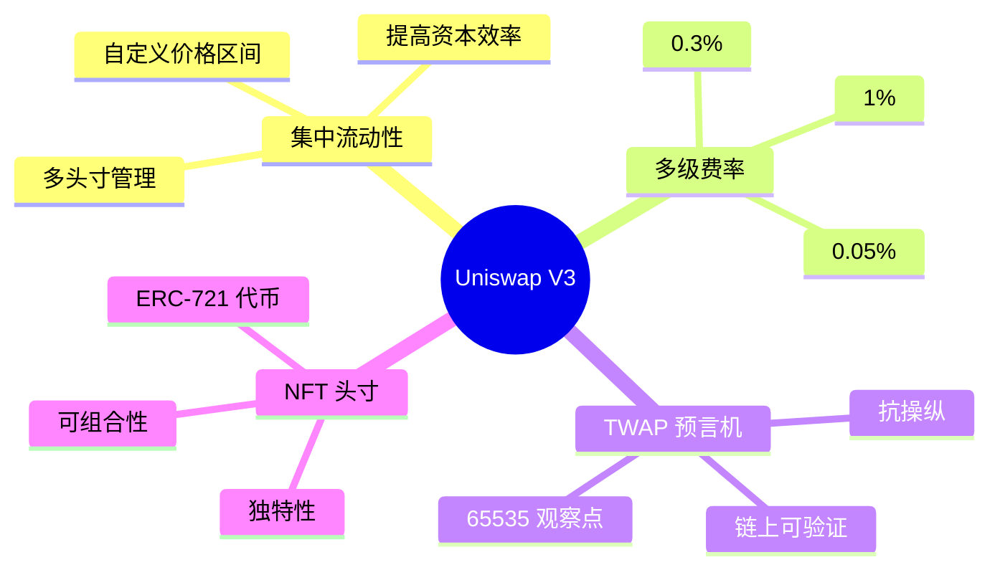

### 系统架构层次

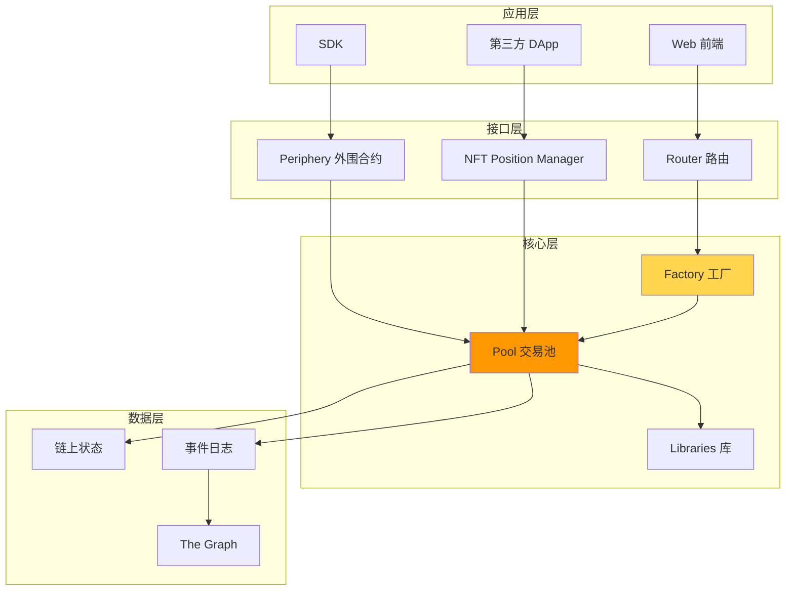

---

## 功能架构

### 1. 核心功能模块

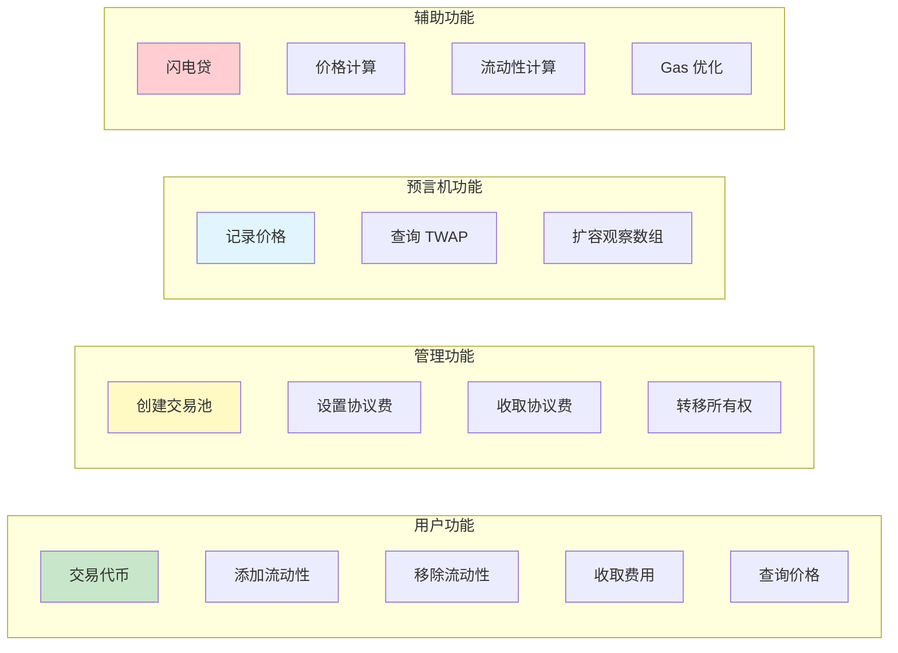

### 2. 功能详细列表

#### 2.1 交易功能

| 功能 | 接口 | 描述 | 权限 |
|------|------|------|------|
| 代币交换 | `swap()` | 在池中交换代币 | 任何人 |
| 精确输入 | `exactInput()` | 指定输入数量的交换 | 任何人 |
| 精确输出 | `exactOutput()` | 指定输出数量的交换 | 任何人 |
| 多跳交换 | `swapMultiHop()` | 通过多个池交换 | 任何人 |
| 闪电贷 | `flash()` | 无抵押借款 | 任何人 |

#### 2.2 流动性管理

| 功能 | 接口 | 描述 | 权限 |
|------|------|------|------|
| 添加流动性 | `mint()` | 在指定价格区间添加流动性 | 任何人 |
| 移除流动性 | `burn()` | 移除流动性并更新费用 | 头寸所有者 |
| 收取费用 | `collect()` | 提取累积的交易费用 | 头寸所有者 |
| 增加流动性 | `increaseLiquidity()` | 向现有头寸增加流动性 | NFT 持有者 |
| 减少流动性 | `decreaseLiquidity()` | 减少现有头寸的流动性 | NFT 持有者 |

#### 2.3 池管理功能

| 功能 | 接口 | 描述 | 权限 |
|------|------|------|------|
| 创建池 | `createPool()` | 部署新的交易池 | 任何人 |
| 初始化池 | `initialize()` | 设置初始价格 | 任何人（一次） |
| 设置协议费 | `setFeeProtocol()` | 设置协议费率 | Factory Owner |
| 收取协议费 | `collectProtocol()` | 提取协议费用 | Factory Owner |
| 启用费率档位 | `enableFeeAmount()` | 添加新的费率档位 | Factory Owner |

#### 2.4 预言机功能

| 功能 | 接口 | 描述 | 权限 |
|------|------|------|------|
| 观察价格 | `observe()` | 查询历史 TWAP | 任何人（只读） |
| 扩容观察数组 | `increaseObservationCardinalityNext()` | 预先扩容 | 任何人 |
| 查询最新观察 | `observations()` | 获取特定索引的观察 | 任何人（只读） |

### 3. 功能交互图

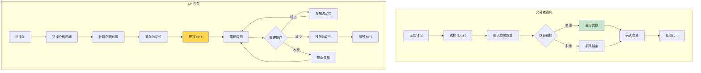

---

## 类图设计

### 1. 核心合约类图

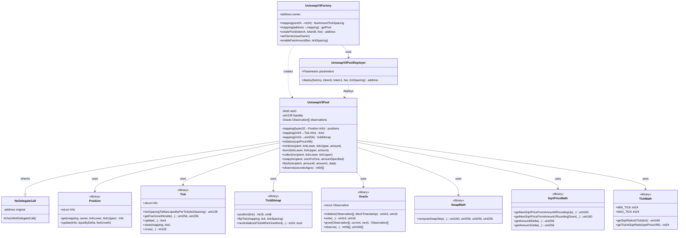

### 2. 数据结构类图

```mermaid
classDiagram
    class Slot0 {
        +uint160 sqrtPriceX96
        +int24 tick
        +uint16 observationIndex
        +uint16 observationCardinality
        +uint16 observationCardinalityNext
        +uint8 feeProtocol
        +bool unlocked
    }
    
    class Position_Info {
        +uint128 liquidity
        +uint256 feeGrowthInside0LastX128
        +uint256 feeGrowthInside1LastX128
        +uint128 tokensOwed0
        +uint128 tokensOwed1
    }
    
    class Tick_Info {
        +uint128 liquidityGross
        +int128 liquidityNet
        +uint256 feeGrowthOutside0X128
        +uint256 feeGrowthOutside1X128
        +int56 tickCumulativeOutside
        +uint160 secondsPerLiquidityOutsideX128
        +uint32 secondsOutside
        +bool initialized
    }
    
    class Oracle_Observation {
        +uint32 blockTimestamp
        +int56 tickCumulative
        +uint160 secondsPerLiquidityCumulativeX128
        +bool initialized
    }
    
    class ModifyPositionParams {
        +address owner
        +int24 tickLower
        +int24 tickUpper
        +int128 liquidityDelta
    }
    
    class SwapCache {
        +uint8 feeProtocol
        +uint128 liquidityStart
        +uint32 blockTimestamp
        +int56 tickCumulative
        +uint160 secondsPerLiquidityCumulativeX128
        +bool computedLatestObservation
    }
    
    class SwapState {
        +int256 amountSpecifiedRemaining
        +int256 amountCalculated
        +uint160 sqrtPriceX96
        +int24 tick
        +uint256 feeGrowthGlobalX128
        +uint128 protocolFee
        +uint128 liquidity
    }
    
    class StepComputations {
        +uint160 sqrtPriceStartX96
        +int24 tickNext
        +bool initialized
        +uint160 sqrtPriceNextX96
        +uint256 amountIn
        +uint256 amountOut
        +uint256 feeAmount
    }
    
    UniswapV3Pool *-- Slot0
    UniswapV3Pool *-- "many" Position_Info
    UniswapV3Pool *-- "many" Tick_Info
    UniswapV3Pool *-- "65535" Oracle_Observation
    UniswapV3Pool ..> ModifyPositionParams : uses
    UniswapV3Pool ..> SwapCache : uses
    UniswapV3Pool ..> SwapState : uses
    UniswapV3Pool ..> StepComputations : uses
```

### 3. 接口类图

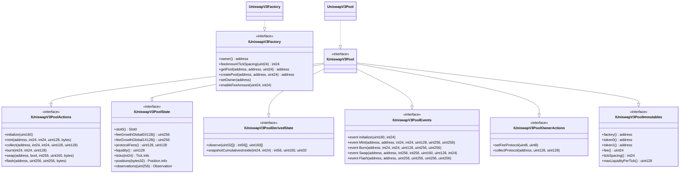

### 4. 回调接口类图

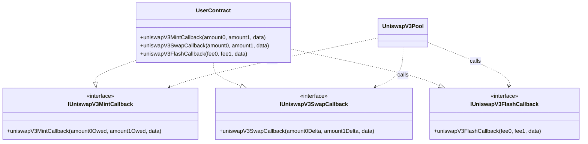

---

## 核心原理

### 1. 集中流动性原理

#### 1.1 传统 AMM vs 集中流动性

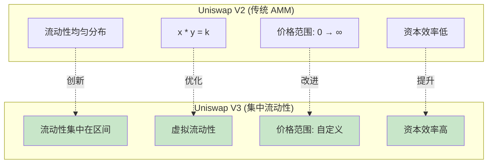

#### 1.2 虚拟流动性公式

```
对于价格区间 [Pa, Pb]:

真实储备量:
x_real = L * (1/√P - 1/√Pb)  (当 P < Pb 时)
y_real = L * (√P - √Pa)      (当 P > Pa 时)

虚拟储备量 (用于计算):
x_virtual = L / √P
y_virtual = L * √P

恒定乘积 (在区间内):
x_virtual * y_virtual = L²
```

#### 1.3 资本效率提升

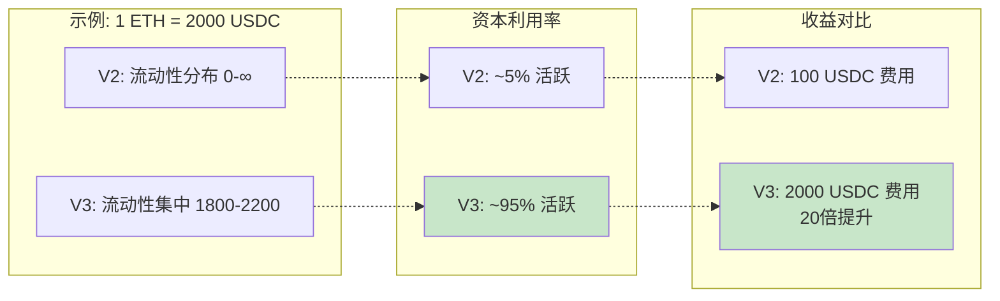

### 2. Tick 系统原理

#### 2.1 价格离散化

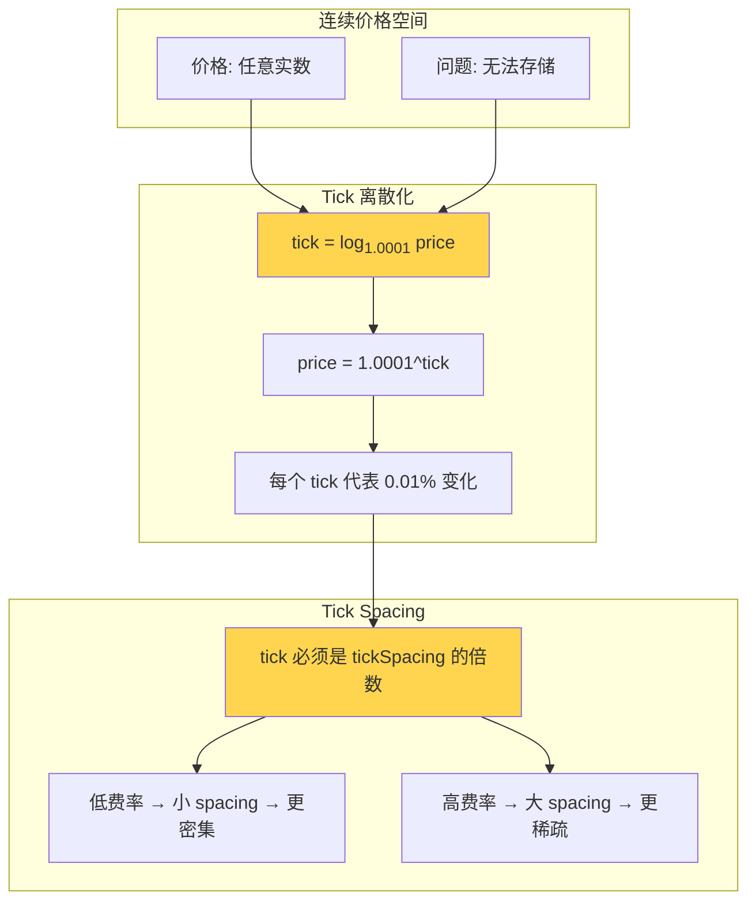

#### 2.2 Tick 数据结构

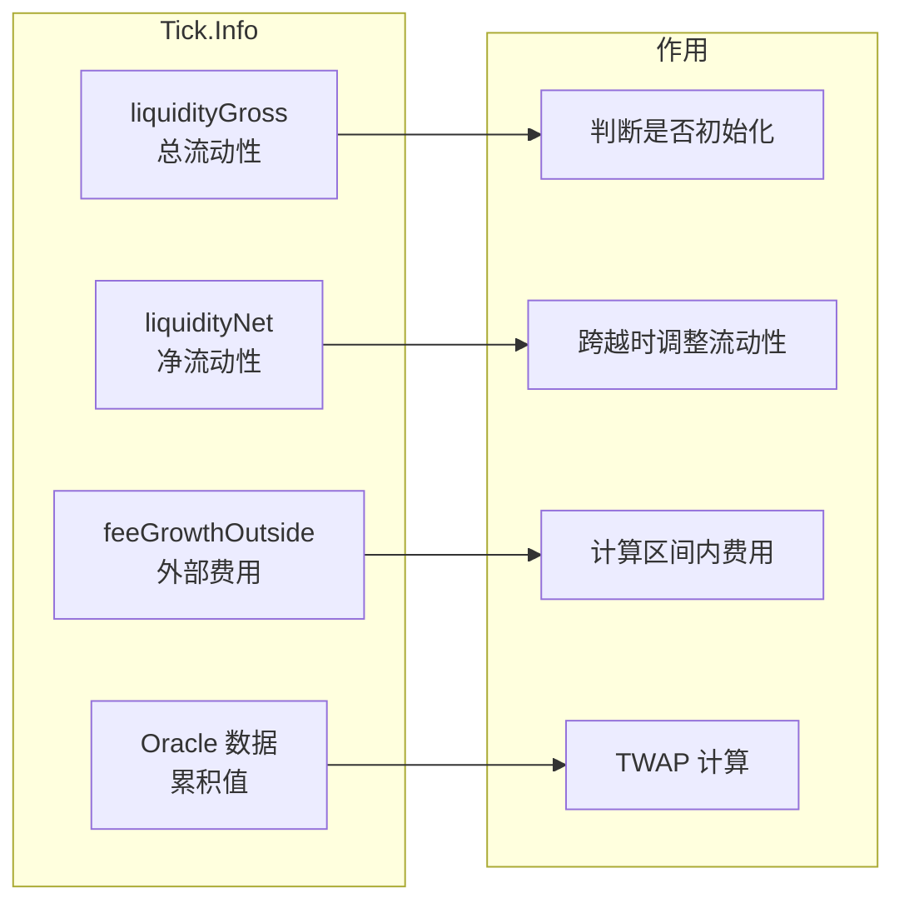

#### 2.3 TickBitmap 索引

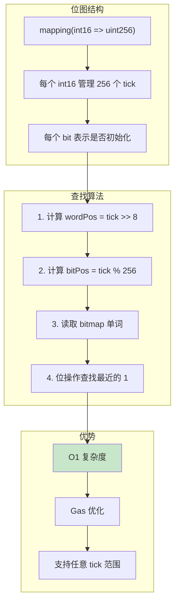

### 3. 费用累积原理

#### 3.1 全局费用增长

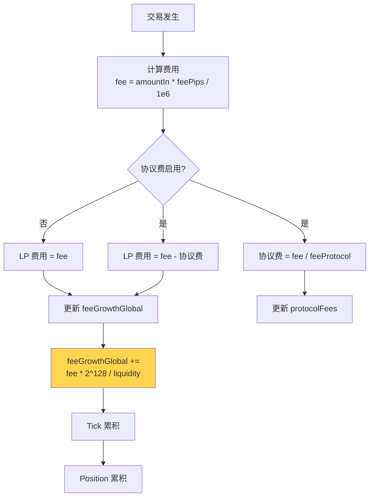

#### 3.2 区间内费用计算

```mermaid
graph LR
    subgraph "数据来源"
        D1[feeGrowthGlobal<br/>全局累积]
        D2[feeGrowthOutside[lower]<br/>下限外部]
        D3[feeGrowthOutside[upper]<br/>上限外部]
    end
    
    subgraph "计算过程"
        direction TB
        C1[确定 below 和 above]
        C2["below = f(current, lower)"]
        C3["above = f(current, upper)"]
        C4["inside = global - below - above"]
    end
    
    subgraph "LP 收益"
        R1["新增费用 = <br/>(inside - insideLast) * L / 2^128"]
        R2[累加到 tokensOwed]
    end
    
    D1 --> C1
    D2 --> C2
    D3 --> C3
    C1 --> C4
    C2 --> C4
    C3 --> C4
    C4 --> R1
    R1 --> R2
    
    style C4 fill:#ffd54f
    style R1 fill:#c8e6c9
```

#### 3.3 "inside" 和 "outside" 概念

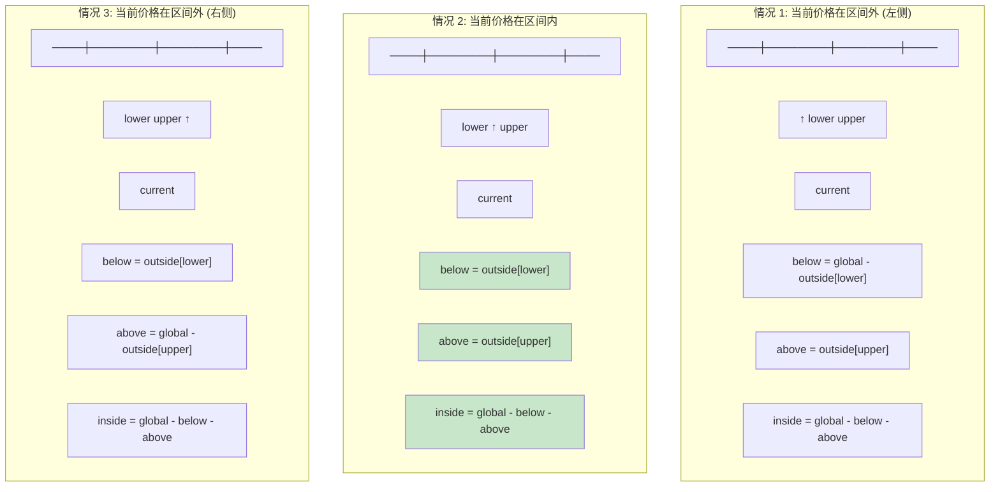

### 4. TWAP 预言机原理

#### 4.1 累积值机制

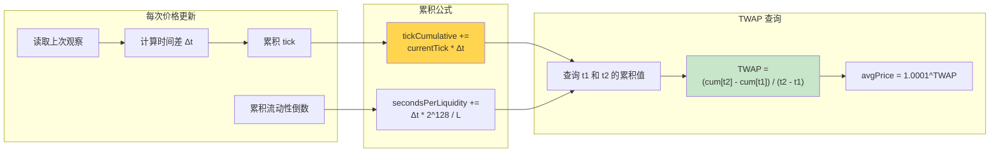

#### 4.2 抗操纵设计

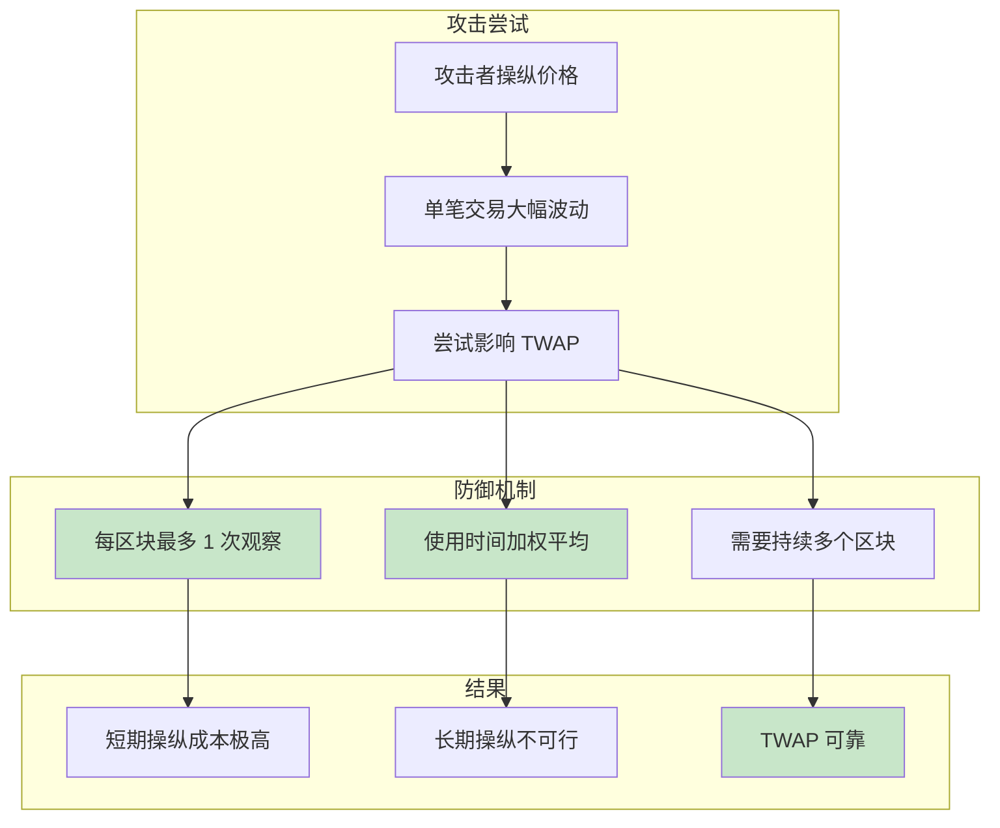

### 5. 数学公式体系

#### 5.1 核心公式汇总

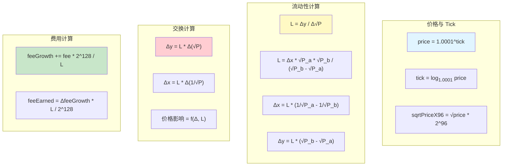

---

## 核心流程

### 1. 创建和初始化池

#### 1.1 流程图

```mermaid
flowchart TD
    A[用户调用 Factory.createPool] --> B{检查池是否存在}
    B -->|已存在| C[❌ 返回错误]
    B -->|不存在| D[对代币排序<br/>确保 token0 < token1]
    
    D --> E{验证参数}
    E -->|token 为零地址| C
    E -->|token 相同| C
    E -->|fee 未启用| C
    E -->|✓ 有效| F[计算 CREATE2 salt]
    
    F --> G[调用 PoolDeployer.deploy]
    G --> H[部署新池合约]
    H --> I[保存池地址到 mapping]
    I --> J[发出 PoolCreated 事件]
    J --> K[✓ 返回池地址]
    
    K --> L[任何人可调用 initialize]
    L --> M[设置初始价格<br/>sqrtPriceX96]
    M --> N[计算初始 tick]
    N --> O[初始化 Oracle[0]]
    O --> P[设置 unlocked = true]
    P --> Q[✓ 池可使用]
    
    style K fill:#c8e6c9
    style Q fill:#c8e6c9
```

#### 1.2 时序图

```mermaid
sequenceDiagram
    actor User
    participant Factory
    participant Deployer
    participant Pool
    
    User->>Factory: createPool(tokenA, tokenB, fee)
    activate Factory
    
    Factory->>Factory: 排序代币<br/>token0, token1
    Factory->>Factory: 验证参数
    
    Factory->>Deployer: deploy(factory, token0, token1, fee, tickSpacing)
    activate Deployer
    
    Deployer->>Deployer: 设置 parameters
    Deployer->>Pool: new UniswapV3Pool{salt}()
    activate Pool
    
    Pool->>Deployer: 读取 parameters
    Deployer-->>Pool: 返回参数
    Pool->>Pool: 设置 immutable 变量
    Pool-->>Deployer: 部署完成
    deactivate Pool
    
    Deployer->>Deployer: 清空 parameters
    Deployer-->>Factory: 返回池地址
    deactivate Deployer
    
    Factory->>Factory: 保存到 getPool mapping
    Factory->>Factory: emit PoolCreated
    Factory-->>User: 返回池地址
    deactivate Factory
    
    User->>Pool: initialize(sqrtPriceX96)
    activate Pool
    Pool->>Pool: 检查 slot0.sqrtPriceX96 == 0
    Pool->>Pool: 设置初始价格和 tick
    Pool->>Pool: 初始化 observations[0]
    Pool->>Pool: 设置 unlocked = true
    Pool-->>User: ✓ 初始化完成
    deactivate Pool
```

#### 1.3 示例代码

```solidity
// 步骤 1: 创建池
address pool = factory.createPool(
    USDC,           // token0 (地址更小)
    WETH,           // token1
    3000            // 0.3% 费率
);

// 步骤 2: 初始化价格
// 假设 1 ETH = 2000 USDC
// sqrtPrice = sqrt(2000) ≈ 44.72
// sqrtPriceX96 = 44.72 * 2^96
uint160 sqrtPriceX96 = 3543191142285914246547271808000;

IUniswapV3Pool(pool).initialize(sqrtPriceX96);
```

### 2. 添加流动性流程

#### 2.1 流程图

```mermaid
flowchart TD
    A[用户调用 mint] --> B[输入参数<br/>tickLower, tickUpper, amount]
    B --> C{验证参数}
    C -->|tick 不对齐| ERR1[❌ 错误]
    C -->|区间无效| ERR1
    C -->|amount = 0| ERR1
    C -->|✓| D[锁定: unlocked = false]
    
    D --> E[调用 _modifyPosition]
    E --> F[计算 position key]
    F --> G[更新 Tick.Info lower]
    G --> H[更新 Tick.Info upper]
    
    H --> I{tick 翻转?}
    I -->|是| J[更新 TickBitmap]
    I -->|否| K[继续]
    J --> K
    
    K --> L{当前价格在区间内?}
    L -->|是| M[更新全局 liquidity]
    L -->|否| N[不更新]
    M --> O[写入 Oracle 观察]
    N --> O
    
    O --> P[计算 feeGrowthInside]
    P --> Q[更新 Position.Info]
    Q --> R[计算所需代币数量<br/>amount0, amount1]
    
    R --> S[回调 mintCallback]
    S --> T[用户转账代币]
    T --> U[验证余额增加]
    
    U --> V{余额验证}
    V -->|失败| ERR2[❌ 回滚]
    V -->|成功| W[解锁: unlocked = true]
    W --> X[发出 Mint 事件]
    X --> Y[✓ 返回 amount0, amount1]
    
    style Y fill:#c8e6c9
```

#### 2.2 时序图

```mermaid
sequenceDiagram
    actor LP
    participant Router
    participant Pool
    participant Position_Lib
    participant Tick_Lib
    participant TickBitmap_Lib
    
    LP->>Router: mint(tickLower, tickUpper, liquidity)
    activate Router
    
    Router->>Pool: mint(LP, tickLower, tickUpper, amount, data)
    activate Pool
    
    Pool->>Pool: lock() - 设置 unlocked=false
    
    Pool->>Position_Lib: get(positions, LP, tickLower, tickUpper)
    Position_Lib-->>Pool: Position.Info
    
    Pool->>Tick_Lib: update(ticks[tickLower], liquidityDelta)
    activate Tick_Lib
    Tick_Lib->>Tick_Lib: 更新 liquidityGross
    Tick_Lib->>Tick_Lib: 更新 liquidityNet
    Tick_Lib->>Tick_Lib: 检查是否翻转
    
    alt Tick 翻转 (0 → 非0)
        Tick_Lib->>TickBitmap_Lib: flipTick(tickLower, tickSpacing)
        TickBitmap_Lib->>TickBitmap_Lib: 设置对应位
    end
    
    Tick_Lib-->>Pool: flipped
    deactivate Tick_Lib
    
    Pool->>Tick_Lib: update(ticks[tickUpper], -liquidityDelta)
    Tick_Lib-->>Pool: flipped
    
    alt 当前价格在区间内
        Pool->>Pool: liquidity += amount
        Pool->>Pool: 写入 Oracle 观察
    end
    
    Pool->>Tick_Lib: getFeeGrowthInside(...)
    Tick_Lib-->>Pool: feeGrowthInside0, feeGrowthInside1
    
    Pool->>Position_Lib: update(position, liquidityDelta, feeGrowthInside)
    activate Position_Lib
    Position_Lib->>Position_Lib: 计算新增费用
    Position_Lib->>Position_Lib: tokensOwed += fees
    Position_Lib->>Position_Lib: liquidity += delta
    Position_Lib->>Position_Lib: 更新 feeGrowthInsideLast
    Position_Lib-->>Pool: ✓
    deactivate Position_Lib
    
    Pool->>Pool: 计算所需代币<br/>amount0 = f(L, Pa, Pb, P)<br/>amount1 = f(L, Pa, Pb, P)
    
    Pool->>Router: uniswapV3MintCallback(amount0, amount1, data)
    activate Router
    Router->>Router: 验证调用者是池
    Router->>Pool: transfer token0 (amount0)
    Router->>Pool: transfer token1 (amount1)
    Router-->>Pool: ✓
    deactivate Router
    
    Pool->>Pool: 验证余额变化
    
    Pool->>Pool: unlock() - 设置 unlocked=true
    Pool->>Pool: emit Mint(...)
    Pool-->>Router: 返回 amount0, amount1
    deactivate Pool
    
    Router-->>LP: ✓ 流动性已添加
    deactivate Router
```

#### 2.3 示例

```solidity
// 场景: Alice 在 1800-2200 USDC/ETH 区间添加流动性
// 当前价格: 2000 USDC/ETH

// 步骤 1: 确定 tick 边界
int24 tickLower = 75060;  // price ≈ 1800
int24 tickUpper = 77640;  // price ≈ 2200

// 步骤 2: 确定流动性数量
uint128 liquidity = 1000000;

// 步骤 3: 计算所需代币
// amount0 (USDC) = L * (1/√P - 1/√Pb)
//                = 1000000 * (1/√2000 - 1/√2200)
//                ≈ 1040 USDC
// amount1 (ETH) = L * (√P - √Pa)
//               = 1000000 * (√2000 - √1800)
//               ≈ 2.29 ETH

// 步骤 4: 调用 mint
(uint256 amount0, uint256 amount1) = pool.mint(
    alice,      // recipient
    tickLower,  // 下限
    tickUpper,  // 上限
    liquidity,  // 流动性数量
    abi.encode(alice)  // callback data
);

// 步骤 5: 在回调中转账
function uniswapV3MintCallback(
    uint256 amount0Owed,
    uint256 amount1Owed,
    bytes calldata data
) external override {
    require(msg.sender == pool, "Invalid caller");
    
    if (amount0Owed > 0) {
        IERC20(token0).transfer(pool, amount0Owed);
    }
    if (amount1Owed > 0) {
        IERC20(token1).transfer(pool, amount1Owed);
    }
}
```

### 3. 交易（Swap）流程

#### 3.1 完整流程图

```mermaid
flowchart TD
    A[用户调用 swap] --> B[输入参数<br/>zeroForOne, amountSpecified, sqrtPriceLimit]
    B --> C[锁定: unlocked = false]
    C --> D[初始化 SwapCache 和 SwapState]
    
    D --> E{amountRemaining != 0<br/>且未达到价格限制?}
    E -->|否| Z[跳到结束]
    E -->|是| F[使用 TickBitmap 查找<br/>下一个初始化的 tick]
    
    F --> G[确定本步骤的<br/>目标价格]
    G --> H[调用 SwapMath.computeSwapStep]
    H --> I[计算:<br/>amountIn, amountOut, feeAmount]
    
    I --> J[更新 state:<br/>amountRemaining, amountCalculated]
    J --> K[更新 feeGrowthGlobal]
    
    K --> L{是否跨越了 tick?}
    L -->|是| M[调用 Tick.cross]
    L -->|否| N[更新当前价格]
    
    M --> O[翻转 feeGrowthOutside]
    O --> P[应用 liquidityNet<br/>更新活跃流动性]
    P --> N
    
    N --> Q[更新 state.sqrtPriceX96]
    Q --> R[更新 state.tick]
    R --> E
    
    Z --> S[更新 Slot0]
    S --> T[写入 Oracle 观察]
    T --> U{zeroForOne?}
    
    U -->|是| V[发送 token1 给接收者]
    U -->|否| W[发送 token0 给接收者]
    
    V --> X[回调 swapCallback]
    W --> X
    
    X --> Y[用户转入所需代币]
    Y --> AA[验证余额]
    AA --> AB{余额验证}
    AB -->|失败| AC[❌ 回滚]
    AB -->|成功| AD[解锁: unlocked = true]
    AD --> AE[发出 Swap 事件]
    AE --> AF[✓ 返回 amount0, amount1]
    
    style AF fill:#c8e6c9
```

#### 3.2 详细时序图

```mermaid
sequenceDiagram
    actor Trader
    participant Router
    participant Pool
    participant TickBitmap
    participant Tick
    participant SwapMath
    participant Oracle
    
    Trader->>Router: swap(amountIn, amountOutMin, path)
    activate Router
    
    Router->>Pool: swap(recipient, zeroForOne, amountSpecified, sqrtPriceLimit, data)
    activate Pool
    
    Pool->>Pool: lock()
    Pool->>Pool: 初始化 SwapCache<br/>缓存 slot0, feeProtocol, liquidity
    Pool->>Pool: 初始化 SwapState<br/>amountRemaining, sqrtPrice, tick, liquidity
    
    loop 直到 amountRemaining = 0 或达到价格限制
        Pool->>TickBitmap: nextInitializedTickWithinOneWord(tick, zeroForOne)
        TickBitmap-->>Pool: tickNext, initialized
        
        Pool->>Pool: 计算 sqrtPriceNextX96<br/>= getSqrtRatioAtTick(tickNext)
        
        Pool->>SwapMath: computeSwapStep(sqrtPrice, sqrtPriceNext, liquidity, amountRemaining)
        activate SwapMath
        SwapMath->>SwapMath: 计算实际可交易数量
        SwapMath->>SwapMath: 计算费用
        SwapMath->>SwapMath: 确定新价格
        SwapMath-->>Pool: sqrtPriceNext, amountIn, amountOut, feeAmount
        deactivate SwapMath
        
        Pool->>Pool: 更新 feeGrowthGlobal<br/>+= feeAmount * Q128 / liquidity
        
        alt 协议费启用
            Pool->>Pool: protocolFee += fee / feeProtocol
        end
        
        Pool->>Pool: 更新 amountRemaining<br/>更新 amountCalculated
        
        alt 价格达到 tickNext
            Pool->>Tick: cross(tickNext)
            activate Tick
            Tick->>Tick: 翻转 feeGrowthOutside<br/>= global - outside
            Tick->>Tick: 翻转 Oracle 累积值
            Tick-->>Pool: liquidityNet
            deactivate Tick
            
            Pool->>Pool: 更新活跃流动性<br/>liquidity ± liquidityNet
        end
        
        Pool->>Pool: 更新 state.sqrtPriceX96<br/>更新 state.tick
    end
    
    Pool->>Pool: 更新 Slot0<br/>sqrtPrice, tick
    
    alt Slot0.tick 变化
        Pool->>Oracle: write(observations, index, timestamp, tick, liquidity)
        activate Oracle
        Oracle->>Oracle: 检查是否同一区块
        Oracle->>Oracle: 计算新的累积值
        Oracle->>Oracle: 写入新观察
        Oracle-->>Pool: 新 index, 新 cardinality
        deactivate Oracle
        Pool->>Pool: 更新 observationIndex
    end
    
    alt zeroForOne (token0 → token1)
        Pool->>Trader: transfer token1 (amountOut)
    else oneForZero (token1 → token0)
        Pool->>Trader: transfer token0 (amountOut)
    end
    
    Pool->>Router: uniswapV3SwapCallback(amount0Delta, amount1Delta, data)
    activate Router
    Router->>Router: 验证调用者
    Router->>Pool: transfer token (amountIn + fee)
    Router-->>Pool: ✓
    deactivate Router
    
    Pool->>Pool: 验证余额变化
    Pool->>Pool: unlock()
    Pool->>Pool: emit Swap(...)
    Pool-->>Router: 返回 amount0, amount1
    deactivate Pool
    
    Router-->>Trader: ✓ 交易完成
    deactivate Router
```

#### 3.3 跨 Tick 示例

```solidity
// 场景: 大额交易跨越多个 tick

// 初始状态:
// - 当前 tick: 76318 (price ≈ 2000)
// - 当前流动性: 1,500,000
// - 下一个初始化 tick: 75900 (Bob 的下限)

// 步骤 1: 开始交易
// 用户用 5000 USDC 买 ETH
swap(
    recipient: trader,
    zeroForOne: true,  // USDC → ETH
    amountSpecified: 5000e6,
    sqrtPriceLimitX96: 0,
    data: ""
);

// 步骤 2: 第一个循环迭代
// - 查找下一个 tick: 75900
// - 计算到达 75900 需要: ~330 USDC
// - 执行部分交易
// - 剩余: 5000 - 330 = 4670 USDC

// 步骤 3: 跨越 tick 75900
Tick.cross(75900) {
    // 翻转 feeGrowthOutside
    feeGrowthOutside0 = feeGrowthGlobal0 - feeGrowthOutside0;
    
    // 更新流动性
    liquidityNet = -500,000;  // Bob 的下限
    liquidity = 1,500,000 - 500,000 = 1,000,000;  // Bob 失活
}

// 步骤 4: 继续交易
// - 当前流动性降低到 1M
// - 继续用剩余 4670 USDC 交易
// - 可能继续跨越更多 tick

// 步骤 5: 最终状态
// - 新 tick: 74200 (price ≈ 1700)
// - 活跃流动性: 1,000,000
// - 获得 ETH: ~2.8 ETH
```

### 4. 收取费用流程

#### 4.1 流程图

```mermaid
flowchart TD
    A[LP 调用 collect] --> B[输入参数<br/>tickLower, tickUpper, amount0, amount1]
    B --> C[调用 _modifyPosition<br/>liquidityDelta = 0]
    
    C --> D[计算 position key]
    D --> E[获取 Position.Info]
    E --> F[计算 feeGrowthInside]
    
    F --> G[计算新增费用<br/>Δfee * liquidity / 2^128]
    G --> H[累加到 tokensOwed]
    H --> I[更新 feeGrowthInsideLast]
    
    I --> J[确定实际转账数量<br/>min(tokensOwed, requested)]
    J --> K[减少 tokensOwed]
    K --> L[转账 token0]
    L --> M[转账 token1]
    M --> N[发出 Collect 事件]
    N --> O[✓ 返回实际转账数量]
    
    style O fill:#c8e6c9
```

#### 4.2 时序图

```mermaid
sequenceDiagram
    actor LP
    participant Pool
    participant Position_Lib
    participant Tick_Lib
    
    LP->>Pool: collect(recipient, tickLower, tickUpper, amount0Max, amount1Max)
    activate Pool
    
    Pool->>Position_Lib: get(LP, tickLower, tickUpper)
    Position_Lib-->>Pool: Position.Info
    
    Pool->>Tick_Lib: getFeeGrowthInside(tickLower, tickUpper, currentTick, ...)
    activate Tick_Lib
    
    Tick_Lib->>Tick_Lib: 计算 feeGrowthBelow
    alt currentTick >= tickLower
        Tick_Lib->>Tick_Lib: below = outside[lower]
    else
        Tick_Lib->>Tick_Lib: below = global - outside[lower]
    end
    
    Tick_Lib->>Tick_Lib: 计算 feeGrowthAbove
    alt currentTick < tickUpper
        Tick_Lib->>Tick_Lib: above = outside[upper]
    else
        Tick_Lib->>Tick_Lib: above = global - outside[upper]
    end
    
    Tick_Lib->>Tick_Lib: inside = global - below - above
    Tick_Lib-->>Pool: feeGrowthInside0, feeGrowthInside1
    deactivate Tick_Lib
    
    Pool->>Position_Lib: update(position, 0, feeGrowthInside)
    activate Position_Lib
    
    Position_Lib->>Position_Lib: 计算新增费用<br/>fee0 = (inside0 - last0) * L / Q128<br/>fee1 = (inside1 - last1) * L / Q128
    Position_Lib->>Position_Lib: tokensOwed0 += fee0<br/>tokensOwed1 += fee1
    Position_Lib->>Position_Lib: 更新 feeGrowthInsideLast
    Position_Lib-->>Pool: ✓
    deactivate Position_Lib
    
    Pool->>Pool: 确定实际转账数量<br/>amount0 = min(tokensOwed0, amount0Max)<br/>amount1 = min(tokensOwed1, amount1Max)
    
    Pool->>Pool: tokensOwed0 -= amount0<br/>tokensOwed1 -= amount1
    
    alt amount0 > 0
        Pool->>LP: transfer token0 (amount0)
    end
    
    alt amount1 > 0
        Pool->>LP: transfer token1 (amount1)
    end
    
    Pool->>Pool: emit Collect(...)
    Pool-->>LP: 返回 amount0, amount1
    deactivate Pool
```

#### 4.3 示例

```solidity
// 场景: Alice 收取累积的费用

// 假设 Alice 的头寸信息:
// - tickLower: 75060
// - tickUpper: 77640
// - liquidity: 1,000,000
// - feeGrowthInside0Last: 1.0e38
// - feeGrowthInside1Last: 0.5e38
// - tokensOwed0: 0
// - tokensOwed1: 0

// 当前全局状态:
// - feeGrowthGlobal0: 1.5e38
// - feeGrowthGlobal1: 0.8e38

// 步骤 1: 计算当前 feeGrowthInside
feeGrowthBelow0 = feeGrowthOutside0[75060];  // 假设 = 0.2e38
feeGrowthAbove0 = feeGrowthOutside0[77640];  // 假设 = 0.1e38
feeGrowthInside0 = 1.5e38 - 0.2e38 - 0.1e38 = 1.2e38

// 步骤 2: 计算新增费用
deltaFeeGrowth0 = 1.2e38 - 1.0e38 = 0.2e38
fees0 = (0.2e38 * 1,000,000) / 2^128
      ≈ 58.8 token0

// 步骤 3: 调用 collect
(uint256 collected0, uint256 collected1) = pool.collect(
    alice,              // recipient
    75060,              // tickLower
    77640,              // tickUpper
    type(uint128).max,  // amount0 Max (全部收取)
    type(uint128).max   // amount1 Max
);

// 结果:
// - collected0 ≈ 58.8 token0
// - collected1 ≈ 相应的 token1
// - Alice 接收代币
// - tokensOwed 清零
```

### 5. 闪电贷流程

#### 5.1 流程图

```mermaid
flowchart TD
    A[用户调用 flash] --> B[输入借款数量<br/>amount0, amount1]
    B --> C[计算费用<br/>fee0, fee1]
    C --> D[锁定: unlocked = false]
    
    D --> E[转账代币给借款人<br/>amount0, amount1]
    E --> F[回调 flashCallback]
    F --> G[借款人执行任意操作<br/>套利、清算等]
    
    G --> H[借款人归还代币+费用]
    H --> I[验证余额增加]
    I --> J{余额检查}
    
    J -->|不足| K[❌ 回滚整个交易]
    J -->|充足| L[更新 feeGrowthGlobal]
    
    L --> M[解锁: unlocked = true]
    M --> N[发出 Flash 事件]
    N --> O[✓ 完成]
    
    style O fill:#c8e6c9
    style K fill:#ffcdd2
```

#### 5.2 时序图

```mermaid
sequenceDiagram
    actor User
    participant FlashBorrower
    participant Pool
    participant DEX
    
    User->>FlashBorrower: 发起闪电贷套利
    activate FlashBorrower
    
    FlashBorrower->>Pool: flash(borrower, amount0, amount1, data)
    activate Pool
    
    Pool->>Pool: 计算费用<br/>fee0 = amount0 * 3 / 1000<br/>fee1 = amount1 * 3 / 1000
    
    Pool->>Pool: lock()
    Pool->>Pool: 记录 balance0Before, balance1Before
    
    alt amount0 > 0
        Pool->>FlashBorrower: transfer token0 (amount0)
    end
    
    alt amount1 > 0
        Pool->>FlashBorrower: transfer token1 (amount1)
    end
    
    Pool->>FlashBorrower: uniswapV3FlashCallback(fee0, fee1, data)
    activate FlashBorrower
    
    Note over FlashBorrower: 借款人执行操作
    
    FlashBorrower->>DEX: 套利交易
    activate DEX
    DEX-->>FlashBorrower: 获得利润
    deactivate DEX
    
    FlashBorrower->>Pool: transfer token0 (amount0 + fee0)
    FlashBorrower->>Pool: transfer token1 (amount1 + fee1)
    FlashBorrower-->>Pool: ✓ 归还完成
    deactivate FlashBorrower
    
    Pool->>Pool: 读取当前余额
    Pool->>Pool: 验证:<br/>balance0 >= balance0Before + fee0<br/>balance1 >= balance1Before + fee1
    
    alt 余额不足
        Pool-->>FlashBorrower: ❌ revert
    else 余额充足
        Pool->>Pool: 更新 feeGrowthGlobal<br/>+= fee * Q128 / liquidity
        
        alt 协议费启用
            Pool->>Pool: protocolFees += fee / feeProtocol
        end
        
        Pool->>Pool: unlock()
        Pool->>Pool: emit Flash(...)
        Pool-->>FlashBorrower: ✓
    end
    
    deactivate Pool
    
    FlashBorrower-->>User: ✓ 套利成功，获得利润
    deactivate FlashBorrower
```

#### 5.3 套利示例

```solidity
// 场景: 闪电贷套利

contract FlashArbitrage {
    IUniswapV3Pool pool;
    address otherDEX;
    
    function executeArbitrage() external {
        // 步骤 1: 发起闪电贷
        // 借入 1000 USDC
        pool.flash(
            address(this),  // recipient
            1000e6,         // amount0 (USDC)
            0,              // amount1 (ETH)
            abi.encode(msg.sender)  // data
        );
    }
    
    function uniswapV3FlashCallback(
        uint256 fee0,
        uint256 fee1,
        bytes calldata data
    ) external override {
        require(msg.sender == address(pool), "Invalid caller");
        
        // 步骤 2: 执行套利
        // 在 Uniswap 借入 1000 USDC (price = 2000)
        // 在另一个 DEX 卖出，价格更高 (price = 2010)
        
        uint256 borrowed = 1000e6;
        uint256 fee = fee0;  // 3 USDC
        
        // 在另一个 DEX 交易
        IERC20(USDC).approve(otherDEX, borrowed);
        uint256 ethReceived = IOtherDEX(otherDEX).swapUSDCForETH(borrowed);
        
        // 在 Uniswap 换回 USDC
        uint256 usdcReceived = pool.swap(...);
        
        // 步骤 3: 归还借款 + 费用
        uint256 amountToRepay = borrowed + fee;
        require(usdcReceived > amountToRepay, "Not profitable");
        
        IERC20(USDC).transfer(address(pool), amountToRepay);
        
        // 步骤 4: 保留利润
        uint256 profit = usdcReceived - amountToRepay;
        address user = abi.decode(data, (address));
        IERC20(USDC).transfer(user, profit);
    }
}

// 实际调用:
// 1. 借入: 1000 USDC
// 2. 费用: 3 USDC (0.3%)
// 3. 套利利润: 10 USDC
// 4. 归还: 1003 USDC
// 5. 净利润: 7 USDC
```

---

## 设计模式

### 1. 工厂模式 (Factory Pattern)

```mermaid
graph TB
    subgraph "工厂模式"
        F[UniswapV3Factory<br/>工厂合约]
        P1[Pool 1]
        P2[Pool 2]
        P3[Pool 3]
        
        F -->|创建| P1
        F -->|创建| P2
        F -->|创建| P3
    end
    
    subgraph "优势"
        A1[统一管理]
        A2[可预测地址<br/>CREATE2]
        A3[参数验证]
    end
    
    style F fill:#ff9800
    style A1 fill:#c8e6c9
    style A2 fill:#c8e6c9
    style A3 fill:#c8e6c9
```

### 2. 库模式 (Library Pattern)

```mermaid
graph LR
    subgraph "纯函数库"
        L1[TickMath]
        L2[FullMath]
        L3[BitMath]
    end
    
    subgraph "状态修改库"
        L4[Position]
        L5[Tick]
        L6[Oracle]
    end
    
    subgraph "计算库"
        L7[SwapMath]
        L8[SqrtPriceMath]
        L9[LiquidityMath]
    end
    
    P[UniswapV3Pool] --> L1
    P --> L2
    P --> L4
    P --> L5
    P --> L7
    
    style P fill:#ff9800
```

**优势**:
- 代码重用
- Gas 优化（DELEGATECALL）
- 模块化设计

### 3. 回调模式 (Callback Pattern)

```mermaid
sequenceDiagram
    participant Pool
    participant User
    
    Pool->>Pool: 执行操作
    Pool->>User: 回调 (callback)
    User->>User: 转账代币
    User-->>Pool: 返回
    Pool->>Pool: 验证余额
    
    alt 余额充足
        Pool->>Pool: ✓ 继续
    else 余额不足
        Pool->>Pool: ❌ 回滚
    end
```

**优势**:
- 灵活的支付方式
- 支持复杂交互
- 安全的资金流

### 4. 不可变模式 (Immutable Pattern)

```solidity
contract UniswapV3Pool {
    address public immutable factory;
    address public immutable token0;
    address public immutable token1;
    uint24 public immutable fee;
    int24 public immutable tickSpacing;
    uint128 public immutable maxLiquidityPerTick;
    
    // 这些值在部署时设置，之后永不改变
}
```

**优势**:
- 节省 Gas（不占用存储槽）
- 提高安全性（防篡改）
- 简化验证逻辑

### 5. 检查-生效-交互模式 (CEI Pattern)

```mermaid
graph TB
    A[Checks 检查] --> B[Effects 生效] --> C[Interactions 交互]
    
    A1[验证参数] --> A
    A2[检查权限] --> A
    A3[检查状态] --> A
    
    B --> B1[更新状态]
    B --> B2[修改存储]
    B --> B3[发出事件]
    
    C --> C1[外部调用]
    C --> C2[代币转账]
    C --> C3[回调]
    
    style A fill:#e1f5ff
    style B fill:#fff9c4
    style C fill:#ffcdd2
```

**防止重入攻击**

### 6. 防御性编程

```mermaid
graph TB
    subgraph "防御措施"
        D1[重入锁<br/>unlocked modifier]
        D2[NoDelegateCall<br/>防止代理调用]
        D3[余额验证<br/>而非信任返回值]
        D4[SafeMath<br/>溢出检查]
        D5[参数验证<br/>require 检查]
    end
    
    subgraph "结果"
        R1[高安全性]
        R2[防攻击]
        R3[可靠性]
    end
    
    D1 --> R1
    D2 --> R1
    D3 --> R2
    D4 --> R2
    D5 --> R3
    
    style R1 fill:#c8e6c9
    style R2 fill:#c8e6c9
    style R3 fill:#c8e6c9
```

---

## 安全架构

### 1. 安全层次

```mermaid
graph TB
    subgraph "合约层安全"
        C1[重入保护]
        C2[权限控制]
        C3[参数验证]
        C4[溢出检查]
    end
    
    subgraph "逻辑层安全"
        L1[余额验证]
        L2[价格限制]
        L3[滑点保护]
        L4[最小流动性]
    end
    
    subgraph "数据层安全"
        D1[不可变状态]
        D2[原子操作]
        D3[事件日志]
    end
    
    subgraph "外部层安全"
        E1[审计]
        E2[Bug Bounty]
        E3[形式化验证]
    end
    
    C1 --> L1 --> D1 --> E1
    
    style C1 fill:#c8e6c9
    style L1 fill:#c8e6c9
    style D1 fill:#c8e6c9
    style E1 fill:#c8e6c9
```

### 2. 重入保护机制

```mermaid
sequenceDiagram
    participant User
    participant Pool
    participant Attacker
    
    User->>Pool: mint() / swap()
    activate Pool
    Pool->>Pool: lock(): unlocked = false ✓
    
    Pool->>Attacker: 回调
    activate Attacker
    Attacker->>Pool: 尝试重入 mint()
    activate Pool
    Pool->>Pool: lock(): require(unlocked) ❌
    Pool-->>Attacker: revert
    deactivate Pool
    Attacker-->>Pool: 返回
    deactivate Attacker
    
    Pool->>Pool: unlock(): unlocked = true
    Pool-->>User: ✓ 完成
    deactivate Pool
```

### 3. NoDelegateCall 保护

```solidity
contract NoDelegateCall {
    address private immutable original;
    
    constructor() {
        original = address(this);
    }
    
    function checkNotDelegateCall() private view {
        require(address(this) == original, "DC");
    }
    
    modifier noDelegateCall() {
        checkNotDelegateCall();
        _;
    }
}

// 使用
function swap(...) external override noDelegateCall {
    // 防止通过 delegatecall 调用
}
```

### 4. 余额验证模式

```mermaid
flowchart TD
    A[操作开始] --> B[记录初始余额<br/>balance0Before]
    B --> C[执行操作<br/>转账、交换等]
    C --> D[回调用户]
    D --> E[用户转账代币]
    E --> F[读取当前余额<br/>balance0After]
    F --> G{验证:<br/>balance0After >= <br/>balance0Before + required?}
    
    G -->|是| H[✓ 继续]
    G -->|否| I[❌ revert 回滚]
    
    style H fill:#c8e6c9
    style I fill:#ffcdd2
```

**为什么不信任返回值？**
- 某些代币不返回 bool
- 返回值可能被操纵
- 余额是唯一真实的状态

---

## 性能优化

### 1. 存储优化

#### 变量打包

```solidity
// ❌ 未优化 (7 个 SLOAD)
uint160 sqrtPriceX96;           // Slot 0
int24 tick;                     // Slot 1
uint16 observationIndex;        // Slot 2
uint16 observationCardinality;  // Slot 3
uint16 observationCardinalityNext; // Slot 4
uint8 feeProtocol;             // Slot 5
bool unlocked;                  // Slot 6

// ✓ 优化后 (1 个 SLOAD)
struct Slot0 {
    uint160 sqrtPriceX96;      // 20 bytes
    int24 tick;                 // 3 bytes
    uint16 observationIndex;    // 2 bytes
    uint16 observationCardinality; // 2 bytes
    uint16 observationCardinalityNext; // 2 bytes
    uint8 feeProtocol;          // 1 byte
    bool unlocked;              // 1 byte
}                               // Total: 31 bytes < 32 bytes ✓
```

**Gas 节省**: 7 × 2100 - 2100 = 12,600 gas (85%)

#### 缓存到内存

```solidity
// ❌ 多次 SLOAD
function badExample() external {
    uint256 price = slot0.sqrtPriceX96;  // SLOAD 1
    int24 tick = slot0.tick;              // SLOAD 2
    bool unlocked = slot0.unlocked;       // SLOAD 3
}

// ✓ 缓存到内存
function goodExample() external {
    Slot0 memory _slot0 = slot0;  // SLOAD 1
    uint256 price = _slot0.sqrtPriceX96;  // MLOAD
    int24 tick = _slot0.tick;              // MLOAD
    bool unlocked = _slot0.unlocked;       // MLOAD
}
```

### 2. 计算优化

#### 使用位运算

```solidity
// TickBitmap 位操作
function position(int24 tick) 
    returns (int16 wordPos, uint8 bitPos) 
{
    wordPos = int16(tick >> 8);        // 除以 256
    bitPos = uint8(tick % 256);        // 取模 256
}

// 设置 bit
function flipTick(int24 tick) {
    (int16 wordPos, uint8 bitPos) = position(tick);
    tickBitmap[wordPos] ^= 1 << bitPos;  // XOR 翻转
}
```

#### Assembly 优化

```solidity
// FullMath: 512 位乘法
function mulDiv(uint256 a, uint256 b, uint256 denominator)
    returns (uint256 result)
{
    // 使用 assembly 实现高精度计算
    assembly {
        let prod0 := mul(a, b)
        let prod1 := mulmod(a, b, not(0))
        // ... 复杂的 512 位除法
    }
}
```

### 3. Gas 成本对比

```mermaid
graph TB
    subgraph "操作成本"
        O1["SLOAD: 2,100 gas"]
        O2["SSTORE 首次: 20,000 gas"]
        O3["SSTORE 更新: 5,000 gas"]
        O4["MLOAD: 3 gas"]
        O5["计算: 3-10 gas"]
    end
    
    subgraph "优化策略"
        S1[减少 SLOAD]
        S2[批量 SSTORE]
        S3[缓存到内存]
        S4[使用位运算]
    end
    
    O1 --> S1
    O2 --> S2
    O3 --> S2
    O4 --> S3
    O5 --> S4
```

### 4. TickBitmap O(1) 查找

```mermaid
graph LR
    A[当前 tick: 76318] --> B[计算 wordPos<br/>= 76318 >> 8 = 298]
    B --> C[读取 bitmap 298]
    C --> D[找到下一个 1 bit<br/>位运算 O1]
    D --> E[返回下一个 tick]
    
    style D fill:#c8e6c9
```

**复杂度对比**:
- 遍历数组: O(n)
- 二分查找: O(log n)
- **TickBitmap: O(1)** ✓

---

## 总结

### 架构特点

```mermaid
mindmap
  root((Uniswap V3<br/>架构))
    模块化
      Factory 工厂
      Pool 核心
      Libraries 库
      Periphery 外围
    高性能
      变量打包
      位图索引
      Assembly 优化
      缓存策略
    安全性
      重入保护
      余额验证
      权限控制
      审计验证
    创新性
      集中流动性
      NFT 头寸
      多级费率
      TWAP 预言机
    可扩展
      灵活费率
      自定义区间
      可组合性
      链上预言机
```

### 核心指标

| 指标 | Uniswap V2 | Uniswap V3 | 提升 |
|------|-----------|-----------|------|
| 资本效率 | 1x | 20-4000x | ⬆️ 显著提升 |
| Gas 成本 | 基准 | 稍高 (~10%) | ➡️ 可接受 |
| 价格精度 | 0.3% 固定 | 0.01% (tick) | ⬆️ 提升 100x |
| 费率选择 | 固定 0.3% | 0.05%/0.3%/1% | ⬆️ 灵活 |
| LP 控制 | 无 | 自定义区间 | ⬆️ 完全控制 |
| 预言机 | 简单 TWAP | 增强 TWAP | ⬆️ 更可靠 |

### 技术创新点

1. **集中流动性**: 革命性的 AMM 设计
2. **Tick 系统**: 离散化价格，高效管理
3. **位图索引**: O(1) 复杂度查找
4. **费用累积**: O(1) 计算每个 LP 收益
5. **NFT 头寸**: 独特且可组合的流动性
6. **多级费率**: 适应不同市场需求
7. **增强预言机**: 链上 TWAP，抗操纵

---

**文档版本**: v1.0  
**生成时间**: 2026-01-15  
**适用于**: Uniswap V3 Core  
**Solidity 版本**: 0.7.6  
**作者**: AI Assistant  

📚 **相关文档**:
- [核心数据结构分析](./Uniswap_V3_核心数据结构分析.md)
- [源码分析报告](./Uniswap_V3_源码分析报告.md)
- [官方白皮书](https://uniswap.org/whitepaper-v3.pdf)

🎉 这份架构设计文档全面梳理了 Uniswap V3 的功能、类图、原理和核心流程，包含 40+ 个 Mermaid 图表！
