# Uniswap V3 核心数据结构深度分析

## 📋 目录

1. [数据结构概览](#数据结构概览)
2. [Slot0 - 主要状态](#slot0---主要状态)
3. [Position.Info - 头寸信息](#positioninfo---头寸信息)
4. [Tick.Info - Tick 信息](#tickinfo---tick-信息)
5. [Oracle.Observation - 预言机观察](#oracleobservation---预言机观察)
6. [其他重要结构](#其他重要结构)
7. [存储布局优化](#存储布局优化)
8. [数据流转分析](#数据流转分析)

---

## 数据结构概览

### 核心数据结构层次

```
UniswapV3Pool
│
├── Slot0 (主要状态) - 1 个存储槽
│   ├── sqrtPriceX96 (uint160) - 当前价格
│   ├── tick (int24) - 当前 tick
│   ├── observationIndex (uint16)
│   ├── observationCardinality (uint16)
│   ├── observationCardinalityNext (uint16)
│   ├── feeProtocol (uint8)
│   └── unlocked (bool)
│
├── Position.Info (头寸) - mapping(bytes32 => Info)
│   ├── liquidity (uint128)
│   ├── feeGrowthInside0LastX128 (uint256)
│   ├── feeGrowthInside1LastX128 (uint256)
│   ├── tokensOwed0 (uint128)
│   └── tokensOwed1 (uint128)
│
├── Tick.Info (Tick 数据) - mapping(int24 => Info)
│   ├── liquidityGross (uint128)
│   ├── liquidityNet (int128)
│   ├── feeGrowthOutside0X128 (uint256)
│   ├── feeGrowthOutside1X128 (uint256)
│   ├── tickCumulativeOutside (int56)
│   ├── secondsPerLiquidityOutsideX128 (uint160)
│   ├── secondsOutside (uint32)
│   └── initialized (bool)
│
└── Oracle.Observation (预言机) - array[65535]
    ├── blockTimestamp (uint32)
    ├── tickCumulative (int56)
    ├── secondsPerLiquidityCumulativeX128 (uint160)
    └── initialized (bool)
```

---

## Slot0 - 主要状态

### 结构体定义

```solidity
struct Slot0 {
    uint160 sqrtPriceX96;           // 当前价格的平方根 (Q64.96)
    int24 tick;                      // 当前 tick
    uint16 observationIndex;         // 预言机观察索引
    uint16 observationCardinality;   // 预言机当前容量
    uint16 observationCardinalityNext; // 预言机目标容量
    uint8 feeProtocol;              // 协议费率
    bool unlocked;                   // 重入锁
}
```

### 存储布局（极致优化！）

```
┌─────────────────────────────────────────────────────────────┐
│                    Slot0 (256 bits / 32 bytes)              │
├──────────────┬───────┬──────┬──────┬──────┬──────┬────────┤
│ sqrtPriceX96 │ tick  │ obIdx│ obCar│obNext│feePro│unlocked│
│   160 bits   │24 bits│16 bit│16 bit│16 bit│8 bit │ 1 bit  │
│   (20 bytes) │(3 b)  │(2 b) │(2 b) │(2 b) │(1 b) │ (1 b)  │
└──────────────┴───────┴──────┴──────┴──────┴──────┴────────┘
     总共 = 160+24+16+16+16+8+1 = 241 bits < 256 bits ✓
```

### 字段详解

#### 1. sqrtPriceX96 (uint160)

```solidity
uint160 sqrtPriceX96;
```

**含义**: 当前价格的平方根，使用 Q64.96 定点数格式

**计算公式**:

```
sqrtPriceX96 = sqrt(price) * 2^96
price = (sqrtPriceX96 / 2^96)^2
price = token1 / token0
```

**为什么使用平方根？**

1. **恒定乘积公式**: `x * y = k` → `L^2 = k`
2. **简化计算**: 使用 `sqrt(price)` 可以更高效地计算代币数量
3. **避免除法**: `Δy = L * Δ(sqrt(P))`，只需乘法

**为什么是 uint160？**

- 足够表示任何以太坊地址（20 字节 = 160 位）
- Q64.96 格式：64 位整数 + 96 位小数
- 价格范围：2^-128 到 2^128

**示例**:

```
价格 = 1 ETH/USDC = 2000 USDC/ETH
sqrtPrice = sqrt(2000) ≈ 44.72
sqrtPriceX96 = 44.72 * 2^96 ≈ 3.54e30
```

#### 2. tick (int24)

```solidity
int24 tick;
```

**含义**: 当前价格对应的 tick（离散化的价格点）

**计算公式**:

```
price = 1.0001^tick
tick = log_{1.0001}(price)
```

**取值范围**:

- 最小值：-887,272
- 最大值：887,272
- 对应价格范围：2^-128 到 2^128

**为什么使用 tick？**

1. **离散化价格**: 将连续的价格空间离散化，便于存储和索引
2. **对数刻度**: 每个 tick 代表 0.01% 的价格变化
3. **空间压缩**: int24 只需 3 字节，可以表示巨大的价格范围

**tick 与价格的关系**:

```
tick = 0   → price = 1
tick = 1   → price = 1.0001
tick = 100 → price ≈ 1.01
tick = 10000 → price ≈ 2.718 (e)
```

#### 3. observationIndex (uint16)

```solidity
uint16 observationIndex;
```

**含义**: 预言机观察数组中最近写入的观察记录的索引

**范围**: 0 到 cardinality-1

**作用**:

- 指向最新的价格观察记录
- 用于 TWAP 计算
- 环形数组的"写指针"

#### 4. observationCardinality (uint16)

```solidity
uint16 observationCardinality;
```

**含义**: 预言机观察数组当前已使用的容量

**初始值**: 1
**最大值**: 65,535

**增长机制**:

```solidity
// 当写入到数组末尾且有扩容请求时，cardinality 增长
if (cardinalityNext > cardinality && index == cardinality - 1) {
    cardinality = cardinalityNext;
}
```

#### 5. observationCardinalityNext (uint16)

```solidity
uint16 observationCardinalityNext;
```

**含义**: 预言机观察数组的目标容量

**作用**:

- 用户可以调用 `increaseObservationCardinalityNext()` 预先扩容
- 扩容需要预写入数据，防止后续交易时的高 gas

**扩容流程**:

```
1. 用户调用 increaseObservationCardinalityNext(100)
2. 预写入 slot[1] 到 slot[99]（blockTimestamp = 1）
3. 后续写入时逐步激活这些槽位
```

#### 6. feeProtocol (uint8)

```solidity
uint8 feeProtocol;
```

**含义**: 协议费率，使用位打包存储两个代币的费率

**位布局**:

```
┌──────────────┬──────────────┐
│  高 4 位     │   低 4 位    │
│  token1 费率 │  token0 费率 │
└──────────────┴──────────────┘
```

**提取方式**:

```solidity
uint8 feeProtocol0 = feeProtocol % 16;      // 低 4 位
uint8 feeProtocol1 = feeProtocol >> 4;      // 高 4 位
```

**取值含义**:

- 0: 关闭协议费
- 4-10: 开启协议费（分母）
  - 4 = 1/4 = 25% 的交易费归协议
  - 5 = 1/5 = 20%
  - 10 = 1/10 = 10%

**示例**:

```solidity
// 设置 token0 协议费 = 5 (20%), token1 = 4 (25%)
feeProtocol = 4 + (5 << 4) = 4 + 80 = 84

// 解析
feeProtocol0 = 84 % 16 = 4   // token0: 25%
feeProtocol1 = 84 >> 4 = 5   // token1: 20%
```

#### 7. unlocked (bool)

```solidity
bool unlocked;
```

**含义**: 重入锁标志

**状态**:

- `true`: 未锁定，可以调用
- `false`: 已锁定，正在执行中

**使用方式**:

```solidity
modifier lock() {
    require(slot0.unlocked, 'LOK');
    slot0.unlocked = false;  // 上锁
    _;
    slot0.unlocked = true;   // 解锁
}
```

**为什么放在 Slot0？**

- 重入锁经常被访问
- 放在 Slot0 可以与其他状态一起读取
- 节省一次 SLOAD（2100 gas）

### 为什么要打包？

**Gas 节省**:

```
未打包（7 个独立变量）:
- 7 次 SLOAD = 7 × 2100 = 14,700 gas

打包（1 个 Slot0）:
- 1 次 SLOAD = 2100 gas

节省: 12,600 gas (85% ↓)
```

**内存布局**:

```
256 bits = 32 bytes
已用: 160+24+16+16+16+8+1 = 241 bits
剩余: 15 bits（未使用）
```

---

## Position.Info - 头寸信息

### 结构体定义

```solidity
struct Info {
    uint128 liquidity;                    // 持有的流动性数量
    uint256 feeGrowthInside0LastX128;     // 上次快照的 token0 费用增长
    uint256 feeGrowthInside1LastX128;     // 上次快照的 token1 费用增长
    uint128 tokensOwed0;                  // 待领取的 token0
    uint128 tokensOwed1;                  // 待领取的 token1
}
```

### 存储布局

```
┌─────────────────────────────────────────────┐
│ Position.Info (5 个槽位 = 160 字节)        │
├─────────────────────────────────────────────┤
│ Slot 0: liquidity (uint128)                │ 16 字节
├─────────────────────────────────────────────┤
│ Slot 1: feeGrowthInside0LastX128 (uint256) │ 32 字节
├─────────────────────────────────────────────┤
│ Slot 2: feeGrowthInside1LastX128 (uint256) │ 32 字节
├─────────────────────────────────────────────┤
│ Slot 3: tokensOwed0 (uint128)              │ 16 字节
│         tokensOwed1 (uint128)              │ 16 字节
└─────────────────────────────────────────────┘
```

### 字段详解

#### 1. liquidity (uint128)

```solidity
uint128 liquidity;
```

**含义**: 该头寸持有的流动性数量

**单位**: 抽象的"流动性单位"（不是代币数量）

**关系**:

```
代币数量 = f(liquidity, price, tick_range)

当价格在区间 [Pa, Pb] 内：
amount0 = liquidity * (1/sqrt(P) - 1/sqrt(Pb))
amount1 = liquidity * (sqrt(P) - sqrt(Pa))
```

**为什么用 uint128？**

- uint128 最大值 ≈ 3.4e38
- 足够表示任何合理的流动性数量
- 与 Tick.liquidityGross 类型一致

#### 2. feeGrowthInside0LastX128 (uint256)

```solidity
uint256 feeGrowthInside0LastX128;
```

**含义**: 上次更新头寸时，价格区间内 token0 的累积费用增长

**格式**: Q128.128 定点数

**计算公式**:

```
累积费用增长 = Σ (fee_i * 2^128 / liquidity_i)
```

**用途**: 计算 LP 应得的费用

```solidity
uint256 feesEarned = (feeGrowthInside0Now - feeGrowthInside0Last) 
                     * liquidity / 2^128;
```

**为什么需要"快照"？**

- 每次修改头寸时记录当前的累积值
- 下次更新时用"当前值 - 上次值"计算新增费用
- O(1) 复杂度，无需遍历所有交易

#### 3. feeGrowthInside1LastX128 (uint256)

```solidity
uint256 feeGrowthInside1LastX128;
```

**含义**: token1 的累积费用增长快照（同上）

#### 4. tokensOwed0 (uint128)

```solidity
uint128 tokensOwed0;
```

**含义**: 待领取的 token0 数量（累积的费用 + burn 后未提取的代币）

**来源**:

1. **交易费用**: 价格区间内交易产生的费用
2. **burn**: 移除流动性后应返还的代币

**领取方式**:

```solidity
collect(recipient, tickLower, tickUpper, amount0, amount1);
```

**为什么分两步（burn + collect）？**

- burn 只更新状态，不转账
- collect 执行实际转账
- 用户可以累积费用，一次性提取，节省 gas

#### 5. tokensOwed1 (uint128)

```solidity
uint128 tokensOwed1;
```

**含义**: 待领取的 token1 数量（同上）

### 头寸键（Position Key）

```solidity
bytes32 key = keccak256(abi.encodePacked(owner, tickLower, tickUpper));
```

**组成**:

- `owner`: 头寸所有者地址（20 字节）
- `tickLower`: 下限 tick（3 字节）
- `tickUpper`: 上限 tick（3 字节）

**特点**:

- 每个用户在每个价格区间只能有一个头寸
- 想要多个头寸？使用不同的价格区间
- 哈希后的键确保唯一性和安全性

### 费用计算流程

```
┌─────────────────────────────────────────────────────┐
│ 1. 池中每次交易都会更新全局费用增长                 │
│    feeGrowthGlobal0 += fee * 2^128 / liquidity      │
└─────────────────────────────────────────────────────┘
                          │
                          ▼
┌─────────────────────────────────────────────────────┐
│ 2. 计算价格区间内的费用增长（getFeeGrowthInside）  │
│    feeGrowthInside = global - below - above         │
└─────────────────────────────────────────────────────┘
                          │
                          ▼
┌─────────────────────────────────────────────────────┐
│ 3. 计算头寸的新增费用                               │
│    newFees = (feeGrowthInside - feeGrowthInsideLast)│
│              * liquidity / 2^128                     │
└─────────────────────────────────────────────────────┘
                          │
                          ▼
┌─────────────────────────────────────────────────────┐
│ 4. 累加到 tokensOwed                                │
│    tokensOwed0 += newFees0                          │
│    tokensOwed1 += newFees1                          │
└─────────────────────────────────────────────────────┘
```

---

## Tick.Info - Tick 信息

### 结构体定义

```solidity
struct Info {
    uint128 liquidityGross;               // 引用此 tick 的总流动性
    int128 liquidityNet;                  // 跨越时的净流动性变化
    uint256 feeGrowthOutside0X128;        // tick 外部的 token0 费用增长
    uint256 feeGrowthOutside1X128;        // tick 外部的 token1 费用增长
    int56 tickCumulativeOutside;          // tick 累积值（预言机）
    uint160 secondsPerLiquidityOutsideX128; // 每单位流动性的秒数（预言机）
    uint32 secondsOutside;                // 在外部的秒数（预言机）
    bool initialized;                     // 是否已初始化
}
```

### 存储布局

```
┌─────────────────────────────────────────────┐
│ Tick.Info (4 个槽位 = 128 字节)            │
├─────────────────────────────────────────────┤
│ Slot 0: liquidityGross (uint128)           │ 16 字节
│         liquidityNet (int128)              │ 16 字节
├─────────────────────────────────────────────┤
│ Slot 1: feeGrowthOutside0X128 (uint256)    │ 32 字节
├─────────────────────────────────────────────┤
│ Slot 2: feeGrowthOutside1X128 (uint256)    │ 32 字节
├─────────────────────────────────────────────┤
│ Slot 3: tickCumulativeOutside (int56)      │ 7 字节
│         secondsPerLiquidityOutsideX128     │ 20 字节
│         secondsOutside (uint32)            │ 4 字节
│         initialized (bool)                 │ 1 字节
└─────────────────────────────────────────────┘
```

### 字段详解

#### 1. liquidityGross (uint128)

```solidity
uint128 liquidityGross;
```

**含义**: 引用此 tick 的总流动性（绝对值之和）

**计算**:

```
liquidityGross = Σ|liquidityDelta_i|
```

**用途**:

- 判断 tick 是否被引用（liquidityGross != 0）
- 计算 tick 是否"翻转"（从 0 变非0，或从非0 变 0）

**示例**:

```
位置 A: [tick=100, tick=200], liquidity=1000
位置 B: [tick=150, tick=200], liquidity=500

tick=100: liquidityGross = 1000
tick=150: liquidityGross = 500
tick=200: liquidityGross = 1000 + 500 = 1500
```

#### 2. liquidityNet (int128)

```solidity
int128 liquidityNet;
```

**含义**: 跨越此 tick 时活跃流动性的净变化（有符号）

**方向约定**:

```
从左到右跨越（价格上升）:
- 跨越下限 tick: liquidityNet 为正（流动性激活）
- 跨越上限 tick: liquidityNet 为负（流动性失活）

从右到左跨越（价格下降）:
- liquidityNet 的符号相反
```

**计算规则**:

```solidity
// 下限 tick
liquidityNet += liquidityDelta;

// 上限 tick
liquidityNet -= liquidityDelta;
```

**示例**:

```
位置 A: [tick=100, tick=200], liquidity=1000

tick=100 (下限): liquidityNet = +1000
tick=200 (上限): liquidityNet = -1000

价格从 90 升到 110:
- 跨越 tick=100
- 活跃流动性增加 1000
```

#### 3. feeGrowthOutside0X128 (uint256)

```solidity
uint256 feeGrowthOutside0X128;
```

**含义**: tick "外部"的 token0 累积费用增长

**"外部"的定义**:

```
如果 当前tick >= 此tick:
    外部 = 左侧（价格更低的一侧）
否则:
    外部 = 右侧（价格更高的一侧）
```

**为什么需要 outside？**

- 用于计算价格区间"内部"的费用
- 公式：`feeInside = feeGlobal - feeBelow - feeAbove`

**初始化时机**:

```solidity
// tick 首次被引用时
if (tick <= currentTick) {
    feeGrowthOutside = feeGrowthGlobal;  // 假设所有历史费用在左侧
} else {
    feeGrowthOutside = 0;  // 假设所有历史费用在右侧
}
```

**跨越时的更新**:

```solidity
// 每次跨越 tick 时，"翻转" outside 的含义
feeGrowthOutside = feeGrowthGlobal - feeGrowthOutside;
```

#### 4. feeGrowthOutside1X128 (uint256)

```solidity
uint256 feeGrowthOutside1X128;
```

**含义**: token1 的外部费用增长（同上）

#### 5. tickCumulativeOutside (int56)

```solidity
int56 tickCumulativeOutside;
```

**含义**: tick 外部的 tick 累积值（用于 TWAP 预言机）

**累积公式**:

```
tickCumulative += currentTick * timeDelta
```

**为什么是 int56？**

- 需要存储长时间的累积值
- int56 可以存储约 2.28 × 10^15 的值
- 足够表示数年的累积

#### 6. secondsPerLiquidityOutsideX128 (uint160)

```solidity
uint160 secondsPerLiquidityOutsideX128;
```

**含义**: tick 外部的"每单位流动性的秒数"累积值

**累积公式**:

```
secondsPerLiquidity += timeDelta * 2^128 / liquidity
```

**用途**: 计算价格在特定区间内的时间加权流动性

#### 7. secondsOutside (uint32)

```solidity
uint32 secondsOutside;
```

**含义**: 价格在 tick 外部的总秒数

**累积公式**:

```
secondsOutside += timeDelta
```

**为什么是 uint32？**

- uint32 可以表示约 136 年的秒数
- 足够长，且节省存储空间

#### 8. initialized (bool)

```solidity
bool initialized;
```

**含义**: tick 是否已初始化（是否有流动性引用）

**等价性**:

```
initialized == true ⟺ liquidityGross > 0
```

**为什么需要额外的布尔值？**

- 防止在跨越新初始化的 tick 时产生昂贵的 SSTORE
- 初始化时设置为 true，之后不再改变（除非清除）

### Tick 的 "inside" 和 "outside" 概念

这是 Uniswap V3 最巧妙的设计之一！

```
价格轴:  ────┼────────┼────────┼────────────>
          tickLower  current   tickUpper

情况 1: current < tickLower
┌────────────┐
│  outside   │ inside │ outside
│  (below)   │        │ (above)
└────────────┘────────┘────────
    ↑ current

情况 2: tickLower <= current < tickUpper
┌────────────┬────────┐
│  outside   │ inside │ outside
│  (below)   │   ↑    │ (above)
└────────────┴─current┴────────

情况 3: current >= tickUpper
┌────────────┬────────┬────────┐
│  outside   │ inside │ outside│
│  (below)   │        │ (above)│
└────────────┴────────┴──↑─────
                      current
```

**计算 inside 的公式**:

```solidity
feeGrowthBelow = (currentTick >= tickLower) 
    ? feeGrowthOutsideLower
    : feeGrowthGlobal - feeGrowthOutsideLower;

feeGrowthAbove = (currentTick < tickUpper)
    ? feeGrowthOutsideUpper
    : feeGrowthGlobal - feeGrowthOutsideUpper;

feeGrowthInside = feeGrowthGlobal - feeGrowthBelow - feeGrowthAbove;
```

---

## Oracle.Observation - 预言机观察

### 结构体定义

```solidity
struct Observation {
    uint32 blockTimestamp;                      // 观察的区块时间戳
    int56 tickCumulative;                       // tick 累积值
    uint160 secondsPerLiquidityCumulativeX128;  // 流动性倒数累积值
    bool initialized;                           // 是否已初始化
}
```

### 存储布局

```
┌─────────────────────────────────────────────┐
│ Observation (2 个槽位 = 64 字节)           │
├─────────────────────────────────────────────┤
│ Slot 0: blockTimestamp (uint32)            │ 4 字节
│         tickCumulative (int56)             │ 7 字节
│         secondsPerLiquidityX128 (uint160)  │ 20 字节
│         initialized (bool)                 │ 1 字节
└─────────────────────────────────────────────┘
总计: 32 字节（1 个槽位！极致优化）
```

### 字段详解

#### 1. blockTimestamp (uint32)

```solidity
uint32 blockTimestamp;
```

**含义**: 观察记录的时间戳

**为什么是 uint32？**

- uint32 可以表示到 2106 年
- 节省存储空间（4 字节 vs 32 字节）
- 溢出处理：代码中有特殊的时间比较逻辑

**溢出安全比较**:

```solidity
function lte(uint32 time, uint32 a, uint32 b) returns (bool) {
    if (a <= time && b <= time) return a <= b;
    
    // 处理溢出情况
    uint256 aAdjusted = a > time ? a : a + 2**32;
    uint256 bAdjusted = b > time ? b : b + 2**32;
    return aAdjusted <= bAdjusted;
}
```

#### 2. tickCumulative (int56)

```solidity
int56 tickCumulative;
```

**含义**: tick 的累积值

**计算公式**:

```
tickCumulative[t] = tickCumulative[t-1] + currentTick * Δt
```

**用途**: 计算 TWAP（时间加权平均价格）

```
TWAP = (tickCumulative[t2] - tickCumulative[t1]) / (t2 - t1)
price = 1.0001^TWAP
```

**为什么是 int56？**

- 需要存储可能非常大的累积值
- tick 可以是负数（价格 < 1）
- int56 足够存储数年的累积

#### 3. secondsPerLiquidityCumulativeX128 (uint160)

```solidity
uint160 secondsPerLiquidityCumulativeX128;
```

**含义**: 每单位流动性的秒数累积值

**计算公式**:

```
secondsPerLiquidityX128[t] = secondsPerLiquidityX128[t-1] 
                            + (Δt * 2^128) / liquidity
```

**用途**: 计算价格在特定区间内的时间加权流动性

**为什么需要这个？**

- 衡量流动性的"时间价值"
- LP 可以根据提供流动性的时间获得奖励
- 用于更复杂的 DeFi 策略

#### 4. initialized (bool)

```solidity
bool initialized;
```

**含义**: 该观察槽位是否已初始化

**用途**:

- 区分"未写入"和"写入但值为 0"
- 用于二分查找时跳过未初始化的槽位

### 观察数组结构

```solidity
Oracle.Observation[65535] public observations;
```

**环形数组**:

```
┌────────────────────────────────────────┐
│  Index:  0   1   2   3  ...  65534    │
│  State:  ○   ●   ●   ●  ...   ○       │
│          └────────────────────┘        │
│          已使用: cardinality           │
└────────────────────────────────────────┘
         ↑
    observationIndex (写指针)

● = 已初始化
○ = 未初始化
```

**写入逻辑**:

```solidity
// 计算下一个索引（环形）
indexUpdated = (index + 1) % cardinality;

// 写入新观察
observations[indexUpdated] = transform(last, timestamp, tick, liquidity);
```

### TWAP 计算示例

```
时刻 t1: tick = 100, tickCumulative = 50000
时刻 t2: tick = 120, tickCumulative = 53600
时间差: Δt = 3600 秒（1 小时）

TWAP = (53600 - 50000) / 3600 = 1 tick/秒
平均 tick ≈ 100

平均价格 = 1.0001^100 ≈ 1.01005
```

---

## 其他重要结构

### 1. ProtocolFees

```solidity
struct ProtocolFees {
    uint128 token0;  // 累积的 token0 协议费
    uint128 token1;  // 累积的 token1 协议费
}
```

**存储布局**: 1 个槽位（32 字节）

**用途**: 记录应支付给协议的费用

### 2. ModifyPositionParams

```solidity
struct ModifyPositionParams {
    address owner;          // 头寸所有者
    int24 tickLower;        // 下限 tick
    int24 tickUpper;        // 上限 tick
    int128 liquidityDelta;  // 流动性变化（正=添加，负=移除）
}
```

**用途**: 作为参数传递给 `_modifyPosition()` 内部函数

### 3. SwapCache

```solidity
struct SwapCache {
    uint8 feeProtocol;                         // 协议费率
    uint128 liquidityStart;                    // 起始流动性
    uint32 blockTimestamp;                     // 时间戳
    int56 tickCumulative;                      // tick 累积值（缓存）
    uint160 secondsPerLiquidityCumulativeX128; // 流动性累积值（缓存）
    bool computedLatestObservation;            // 是否已计算最新观察
}
```

**用途**: 在 swap 过程中缓存数据，避免重复 SLOAD

### 4. SwapState

```solidity
struct SwapState {
    int256 amountSpecifiedRemaining;  // 剩余待交易数量
    int256 amountCalculated;          // 已计算的输出数量
    uint160 sqrtPriceX96;             // 当前价格
    int24 tick;                       // 当前 tick
    uint256 feeGrowthGlobalX128;      // 费用增长
    uint128 protocolFee;              // 协议费累积
    uint128 liquidity;                // 当前流动性
}
```

**用途**: 追踪 swap 过程中的状态变化

### 5. StepComputations

```solidity
struct StepComputations {
    uint160 sqrtPriceStartX96;  // 步骤起始价格
    int24 tickNext;             // 下一个 tick
    bool initialized;           // 下一个 tick 是否已初始化
    uint160 sqrtPriceNextX96;   // 下一个 tick 的价格
    uint256 amountIn;           // 输入数量
    uint256 amountOut;          // 输出数量
    uint256 feeAmount;          // 费用数量
}
```

**用途**: 计算单步交易的各项数值

---

## 存储布局优化

### Gas 优化策略总结

#### 1. 变量打包

```solidity
// ❌ 未优化（7 个槽位）
uint160 sqrtPriceX96;      // Slot 0
int24 tick;                // Slot 1
uint16 observationIndex;   // Slot 2
// ... 每个变量占一个槽位

// ✅ 优化后（1 个槽位）
struct Slot0 {
    uint160 sqrtPriceX96;           // 20 字节
    int24 tick;                      // 3 字节
    uint16 observationIndex;         // 2 字节
    uint16 observationCardinality;   // 2 字节
    uint16 observationCardinalityNext; // 2 字节
    uint8 feeProtocol;              // 1 字节
    bool unlocked;                   // 1 字节
    // 总计 31 字节 < 32 字节 ✓
}
```

**节省**: 6 个 SLOAD = 12,600 gas

#### 2. 位打包

```solidity
// feeProtocol 使用 1 个字节存储两个费率
uint8 feeProtocol = token0Fee + (token1Fee << 4);
```

**节省**: 1 个存储槽 = 20,000 gas (SSTORE)

#### 3. 观察记录优化

```solidity
// Observation 打包到 1 个槽位
struct Observation {
    uint32 blockTimestamp;      // 4 字节
    int56 tickCumulative;       // 7 字节
    uint160 secondsPerX128;     // 20 字节
    bool initialized;           // 1 字节
    // 总计 32 字节 = 正好 1 个槽位
}
```

**节省**: 每个观察记录 1 个槽位

### 存储操作成本

| 操作 | Gas 成本 | 说明 |
|------|---------|------|
| SLOAD | 2,100 | 读取存储槽 |
| SSTORE (0→非0) | 20,000 | 首次写入 |
| SSTORE (非0→非0) | 5,000 | 更新已有值 |
| SSTORE (非0→0) | 5,000 - 15,000 | 清除（有退款）|

### 优化技巧

1. **缓存到内存**

```solidity
Slot0 memory _slot0 = slot0;  // 一次 SLOAD
// 多次使用 _slot0，避免重复 SLOAD
```

1. **批量更新**

```solidity
// ❌ 分别更新
slot0.sqrtPriceX96 = newPrice;  // SSTORE
slot0.tick = newTick;            // SSTORE

// ✅ 一次更新
slot0 = Slot0({...});  // 1 次 SSTORE
```

1. **延迟写入**

```solidity
// 只有在需要时才写入存储
if (state.tick != slot0Start.tick) {
    slot0.tick = state.tick;
}
```

---

## 数据流转分析

### 1. Mint 流程中的数据流转

```
用户调用 mint(recipient, tickLower, tickUpper, amount, data)
    │
    ├─→ 读取 Slot0
    │   └─→ 缓存当前价格和 tick
    │
    ├─→ 更新 Position.Info
    │   ├─→ 计算新增费用
    │   ├─→ liquidity += amount
    │   └─→ 更新 feeGrowthInsideLast
    │
    ├─→ 更新 Tick.Info (tickLower 和 tickUpper)
    │   ├─→ liquidityGross += amount
    │   ├─→ liquidityNet ± amount
    │   └─→ 如果翻转，更新 TickBitmap
    │
    ├─→ 如果当前价格在区间内
    │   ├─→ 更新 liquidity (全局)
    │   └─→ 写入 Oracle.Observation
    │
    └─→ 计算并返回需要的 token0 和 token1 数量
```

### 2. Swap 流程中的数据流转

```
用户调用 swap(recipient, zeroForOne, amountSpecified, sqrtPriceLimit, data)
    │
    ├─→ 读取 Slot0
    │   └─→ 缓存起始状态到 SwapCache
    │
    ├─→ 初始化 SwapState
    │   ├─→ amountRemaining = amountSpecified
    │   ├─→ currentPrice = slot0.sqrtPriceX96
    │   └─→ currentTick = slot0.tick
    │
    ├─→ While (amountRemaining != 0 && price != priceLimit)
    │   │
    │   ├─→ 使用 TickBitmap 查找下一个已初始化的 tick
    │   │   └─→ O(1) 复杂度的位图查找
    │   │
    │   ├─→ 使用 SwapMath 计算单步交易
    │   │   ├─→ amountIn
    │   │   ├─→ amountOut
    │   │   └─→ feeAmount
    │   │
    │   ├─→ 更新 feeGrowthGlobal
    │   │   └─→ += feeAmount * 2^128 / liquidity
    │   │
    │   ├─→ 如果跨越了 tick
    │   │   ├─→ 调用 Tick.cross()
    │   │   │   └─→ "翻转" outside 数据
    │   │   └─→ 更新活跃流动性
    │   │       └─→ liquidity ± liquidityNet
    │   │
    │   └─→ 更新 SwapState
    │       ├─→ amountRemaining -= amountIn
    │       └─→ currentPrice = newPrice
    │
    ├─→ 更新 Slot0
    │   ├─→ sqrtPriceX96 = finalPrice
    │   ├─→ tick = finalTick
    │   └─→ 如果 tick 变化，写入 Oracle
    │
    └─→ 转账代币（通过回调 + 余额验证）
```

### 3. 费用累积流程

```
交易发生
    │
    ├─→ 计算费用
    │   └─→ fee = amountIn * feePips / 1e6
    │
    ├─→ 更新全局费用增长
    │   ├─→ feeGrowthGlobal0X128 += fee * 2^128 / liquidity
    │   └─→ feeGrowthGlobal1X128 += fee * 2^128 / liquidity
    │
    ├─→ 如果启用协议费
    │   ├─→ protocolFee = fee / feeProtocol
    │   └─→ protocolFees.token0 += protocolFee
    │
    └─→ LP 在更新头寸时
        ├─→ 计算 feeGrowthInside
        │   └─→ global - below - above
        │
        ├─→ 计算应得费用
        │   └─→ (feeGrowthInside - feeGrowthInsideLast) * liquidity / 2^128
        │
        └─→ 累加到 tokensOwed
            └─→ position.tokensOwed0 += newFees
```

### 4. Oracle 更新流程

```
需要更新 Oracle（swap 或 mint/burn 时 tick 变化）
    │
    ├─→ 检查是否同一区块
    │   └─→ 如果 timestamp 相同，跳过（每区块最多 1 次）
    │
    ├─→ 计算新的累积值
    │   ├─→ tickCumulative += currentTick * timeDelta
    │   └─→ secondsPerLiquidityX128 += timeDelta * 2^128 / liquidity
    │
    ├─→ 确定写入位置
    │   ├─→ index = (oldIndex + 1) % cardinality
    │   └─→ 如果到达末尾且有扩容请求，增加 cardinality
    │
    ├─→ 写入新观察
    │   └─→ observations[index] = newObservation
    │
    └─→ 更新 Slot0
        ├─→ observationIndex = newIndex
        └─→ observationCardinality = newCardinality
```

---

## 总结

### 核心设计原则

1. **极致的 Gas 优化**
   - 变量打包（Slot0）
   - 位打包（feeProtocol）
   - 缓存常用数据

2. **O(1) 复杂度算法**
   - 费用累积（无需遍历交易）
   - Tick 查找（位图索引）
   - 头寸更新（直接计算）

3. **数学精度**
   - Q64.96 定点数（价格）
   - Q128.128 定点数（费用）
   - 避免浮点数不精确

4. **安全性**
   - 重入保护（unlocked）
   - 溢出检查（SafeMath）
   - 余额验证（而非返回值）

5. **灵活性**
   - 集中流动性（任意价格区间）
   - 多级费率（0.05%/0.3%/1%）
   - 可扩展的预言机

### 数据结构关系图

```
Pool (池)
  │
  ├─ Slot0 (当前状态)
  │   └─ sqrtPriceX96, tick, unlocked...
  │
  ├─ Position.Info (头寸) [mapping]
  │   └─ key: keccak256(owner, tickLower, tickUpper)
  │       └─ liquidity, feeGrowthLast, tokensOwed
  │
  ├─ Tick.Info (Tick 数据) [mapping]
  │   └─ key: tick (int24)
  │       └─ liquidityGross/Net, feeGrowthOutside
  │
  ├─ TickBitmap (位图索引) [mapping]
  │   └─ key: wordPos (int16)
  │       └─ value: uint256 (256 个 tick 的位)
  │
  └─ Oracle.Observation (预言机) [array]
      └─ index: 0 to 65534
          └─ timestamp, tickCumulative, secondsPerLiquidityX128
```

---

## 数据结构变化实例演示

为了更好地理解这些数据结构如何工作，让我们通过具体示例来演示在不同操作下的数据变化。

### 场景设置

假设一个 ETH/USDC 交易池：

- **token0**: USDC
- **token1**: ETH
- **fee**: 3000 (0.3%)
- **tickSpacing**: 60
- **初始价格**: 1 ETH = 2000 USDC

### 场景 1：池初始化

#### 流程图

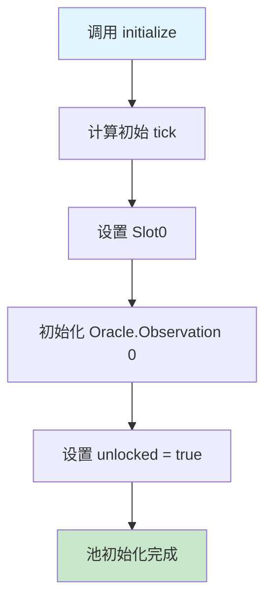

#### 状态初始化图

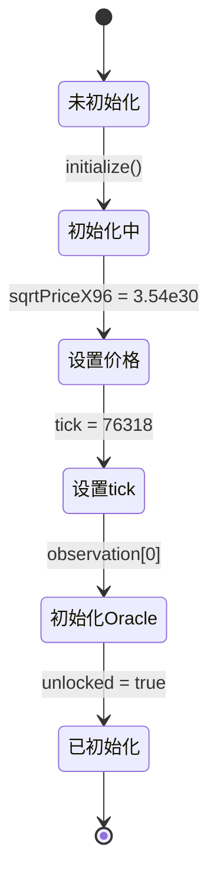

#### 操作

```solidity
pool.initialize(sqrtPriceX96);
// price = 2000, sqrtPrice = 44.72, sqrtPriceX96 = 3.54e30
```

#### 数据结构状态

**Slot0**:

```
┌─────────────────────────────────────────────────┐
│ sqrtPriceX96:  3543191142285914246547271808000  │
│ tick:          76318                             │
│ observationIndex: 0                              │
│ observationCardinality: 1                        │
│ observationCardinalityNext: 1                    │
│ feeProtocol: 0                                   │
│ unlocked: true                                   │
└─────────────────────────────────────────────────┘
```

**Oracle.Observation[0]**:

```
┌─────────────────────────────────────────────────┐
│ blockTimestamp: 1705315200 (当前时间)           │
│ tickCumulative: 0                                │
│ secondsPerLiquidityCumulativeX128: 0             │
│ initialized: true                                │
└─────────────────────────────────────────────────┘
```

**全局状态**:

```
liquidity: 0
feeGrowthGlobal0X128: 0
feeGrowthGlobal1X128: 0
```

---

### 场景 2：Alice 添加流动性

#### 数据流转序列图

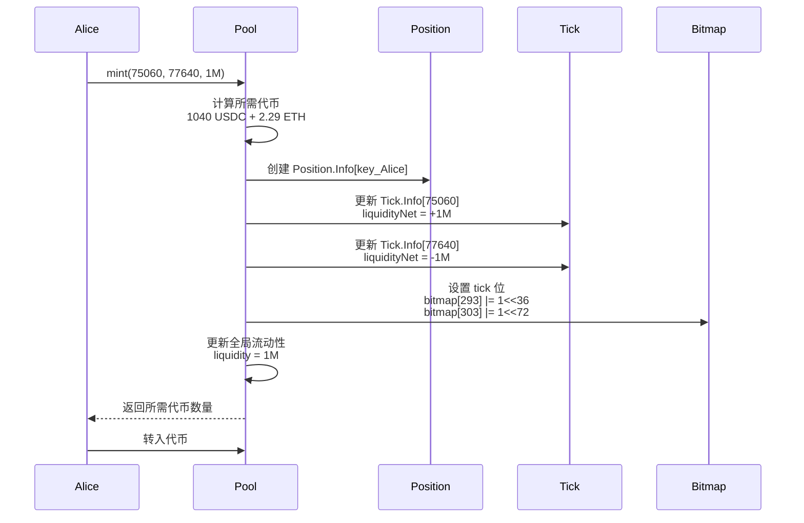

#### 流动性区间可视化

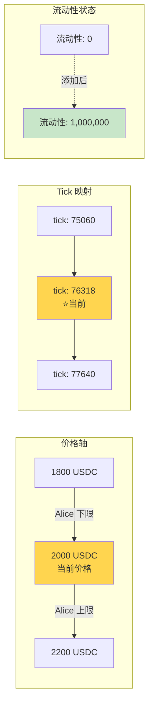

#### 操作

```solidity
// Alice 在价格区间 [1800, 2200] 添加流动性
// tick = 75054 (price=1800), tick = 77622 (price=2200)
// liquidity = 1,000,000

alice.mint(
    recipient: Alice,
    tickLower: 75060,  // 对齐到 tickSpacing=60
    tickUpper: 77640,
    amount: 1000000
);
```

#### 计算所需代币

当前价格 2000 在区间内，需要两种代币：

```
amount0 (USDC) = L * (1/sqrt(P) - 1/sqrt(Pb))
               = 1000000 * (1/√2000 - 1/√2200)
               = 1000000 * (0.02236 - 0.02132)
               = 1040 USDC

amount1 (ETH) = L * (sqrt(P) - sqrt(Pa))
              = 1000000 * (√2000 - √1800)
              = 1000000 * (44.72 - 42.43)
              = 2.29 ETH
```

#### 数据结构变化

**Position.Info[key_Alice]**:

```
key = keccak256(Alice, 75060, 77640)

┌─────────────────────────────────────────────────┐
│ liquidity: 1,000,000                             │
│ feeGrowthInside0LastX128: 0                      │
│ feeGrowthInside1LastX128: 0                      │
│ tokensOwed0: 0                                   │
│ tokensOwed1: 0                                   │
└─────────────────────────────────────────────────┘
```

**Tick.Info[75060]** (下限):

```
┌─────────────────────────────────────────────────┐
│ liquidityGross: 1,000,000                        │
│ liquidityNet: +1,000,000  (价格上升时激活)      │
│ feeGrowthOutside0X128: 0                         │
│ feeGrowthOutside1X128: 0                         │
│ tickCumulativeOutside: 0                         │
│ secondsPerLiquidityOutsideX128: 0                │
│ secondsOutside: 0                                │
│ initialized: true                                │
└─────────────────────────────────────────────────┘
```

**Tick.Info[77640]** (上限):

```
┌─────────────────────────────────────────────────┐
│ liquidityGross: 1,000,000                        │
│ liquidityNet: -1,000,000  (价格上升时失活)      │
│ feeGrowthOutside0X128: 0                         │
│ feeGrowthOutside1X128: 0                         │
│ tickCumulativeOutside: 0                         │
│ secondsPerLiquidityOutsideX128: 0                │
│ secondsOutside: 0                                │
│ initialized: true                                │
└─────────────────────────────────────────────────┘
```

**TickBitmap** (位图更新):

```
wordPos = 75060 >> 8 = 293
bitPos = 75060 % 256 = 36

tickBitmap[293] |= (1 << 36)  // 设置第 36 位

wordPos = 77640 >> 8 = 303
bitPos = 77640 % 256 = 72

tickBitmap[303] |= (1 << 72)  // 设置第 72 位
```

**Slot0** (全局流动性更新):

```
┌─────────────────────────────────────────────────┐
│ liquidity: 1,000,000  (从 0 增加到 1M)          │
│ (其他字段不变)                                   │
└─────────────────────────────────────────────────┘
```

---

### 场景 3：Bob 添加重叠流动性

#### 流动性叠加示意图

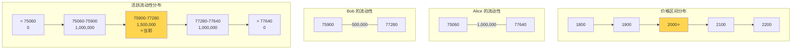

#### 流动性变化时间线

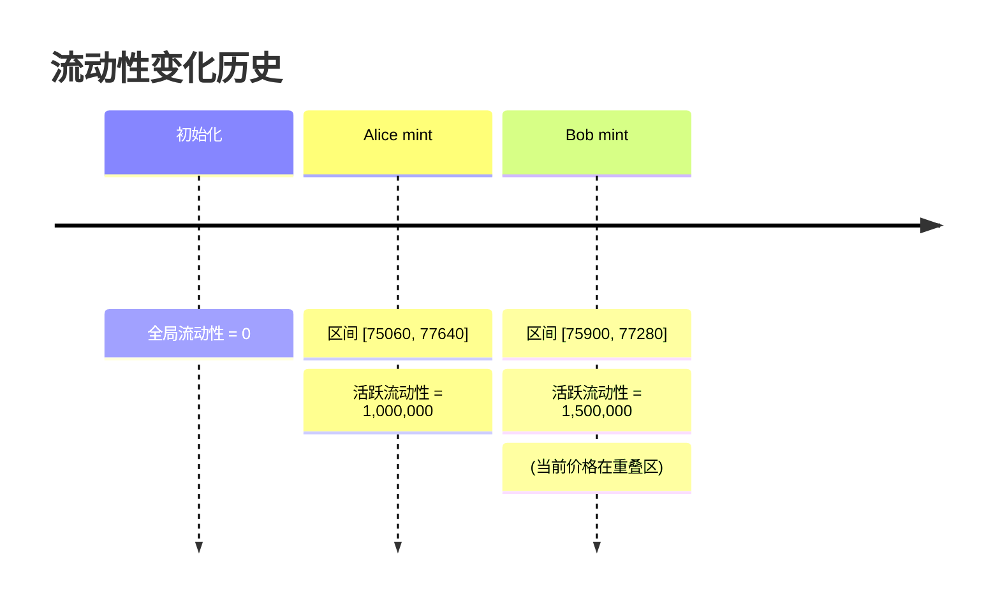

#### 操作

```solidity
// Bob 在价格区间 [1900, 2100] 添加流动性
// liquidity = 500,000

bob.mint(
    recipient: Bob,
    tickLower: 75900,
    tickUpper: 77280,
    amount: 500000
);
```

#### 数据结构变化

**Position.Info[key_Bob]**:

```
key = keccak256(Bob, 75900, 77280)

┌─────────────────────────────────────────────────┐
│ liquidity: 500,000                               │
│ feeGrowthInside0LastX128: 0                      │
│ feeGrowthInside1LastX128: 0                      │
│ tokensOwed0: 0                                   │
│ tokensOwed1: 0                                   │
└─────────────────────────────────────────────────┘
```

**Tick.Info[75900]** (Bob 的下限):

```
┌─────────────────────────────────────────────────┐
│ liquidityGross: 500,000                          │
│ liquidityNet: +500,000                           │
│ (其他字段初始化为 0)                             │
└─────────────────────────────────────────────────┘
```

**Tick.Info[77280]** (Bob 的上限):

```
┌─────────────────────────────────────────────────┐
│ liquidityGross: 500,000                          │
│ liquidityNet: -500,000                           │
│ (其他字段初始化为 0)                             │
└─────────────────────────────────────────────────┘
```

**全局流动性**:

```
当前 tick = 76318 (价格 2000)
Bob 的区间包含当前价格

liquidity: 1,000,000 + 500,000 = 1,500,000
```

**流动性分布图**:

```
价格轴:  1800      1900      2000      2100      2200
       ┼─────────┼─────────┼─────────┼─────────┼─────────>
Tick:  75060     75900     76318     77280     77640

Alice: [══════════════════════════════════════════]  1M
Bob:              [═══════════════════════]          500K

活跃流动性:
  < 75060:         0
  75060-75900:     1,000,000
  75900-77280:     1,500,000  ← 当前价格在此区间
  77280-77640:     1,000,000
  > 77640:         0
```

---

### 场景 4：用户交易 (买入 ETH)

#### 交易流程图

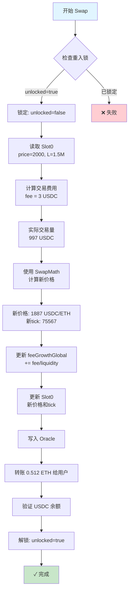

#### 价格变化示意图

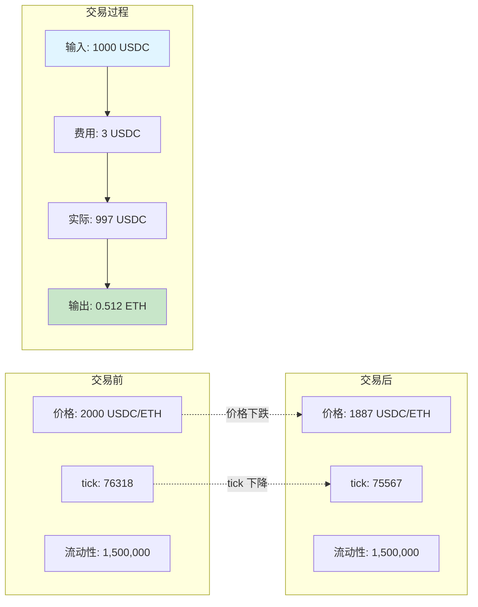

#### 费用累积机制图

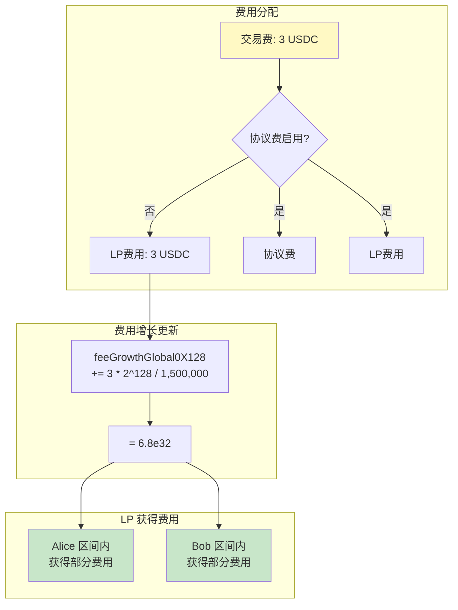

#### 操作

```solidity
// 用户用 1000 USDC 买 ETH
trader.swap(
    recipient: Trader,
    zeroForOne: true,  // USDC → ETH
    amountSpecified: 1000e6,  // 1000 USDC
    sqrtPriceLimitX96: 0
);
```

#### 交易过程分析

**步骤 1: 初始状态**

```
当前价格: 2000 USDC/ETH
当前流动性: 1,500,000
输入: 1000 USDC
```

**步骤 2: 计算交易费用**

```
fee = 1000 * 0.003 = 3 USDC
实际用于交易的 USDC = 997 USDC
```

**步骤 3: 计算新价格和输出**

```
使用 SwapMath.computeSwapStep():

Δ(1/√P) = 997 / 1,500,000 = 0.000665

1/√P_new = 1/√2000 + 0.000665
         = 0.02236 + 0.000665
         = 0.02302

√P_new = 43.44
P_new = 1887 USDC/ETH

ETH 输出 = L * Δ√P
         = 1,500,000 * (44.72 - 43.44)
         = 1,500,000 * 1.28
         = 0.512 ETH
```

**步骤 4: 更新费用增长**

```
feeGrowthGlobal0X128 += (3 * 2^128) / 1,500,000
                      = (3 * 3.4e38) / 1,500,000
                      = 6.8e32
```

#### 数据结构变化

**Slot0** (价格和 tick 更新):

```
┌─────────────────────────────────────────────────┐
│ sqrtPriceX96:  3442899871234567890123456789000  │
│ tick:          75567  (从 76318 下降)           │
│ observationIndex: 0                              │
│ (其他字段不变)                                   │
└─────────────────────────────────────────────────┘
```

**全局状态**:

```
feeGrowthGlobal0X128: 0 + 6.8e32 = 6.8e32
feeGrowthGlobal1X128: 0 (没有 ETH 作为输入)
liquidity: 1,500,000 (不变，未跨越 tick)
```

**Oracle.Observation** (如果过了一段时间):

```
假设距离初始化过了 3600 秒

┌─────────────────────────────────────────────────┐
│ blockTimestamp: 1705318800 (+3600 秒)           │
│ tickCumulative: 76318 * 3600 = 274,744,800      │
│ secondsPerLiquidityX128:                         │
│   (3600 * 2^128) / 1,500,000 = 8.16e32          │
│ initialized: true                                │
└─────────────────────────────────────────────────┘
```

**Position 数据** (尚未更新，等待下次修改):

```
Alice 和 Bob 的 Position.Info 暂时不变
但他们已经累积了费用！
```

---

### 场景 5：跨越 Tick 的大额交易

#### Tick 跨越流程图

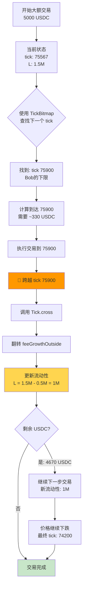

#### 流动性变化动画

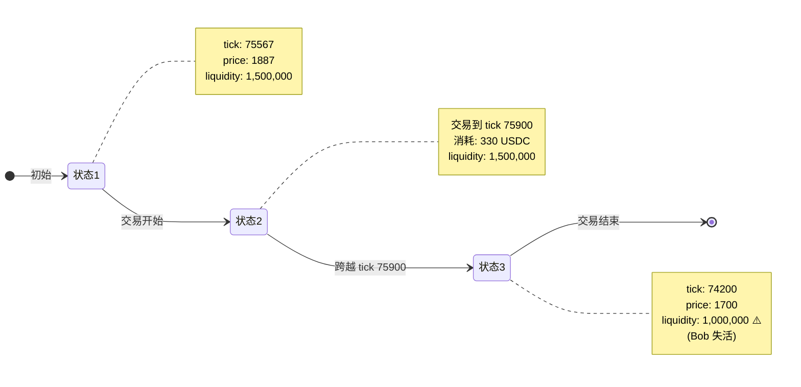

#### Tick 跨越详细图

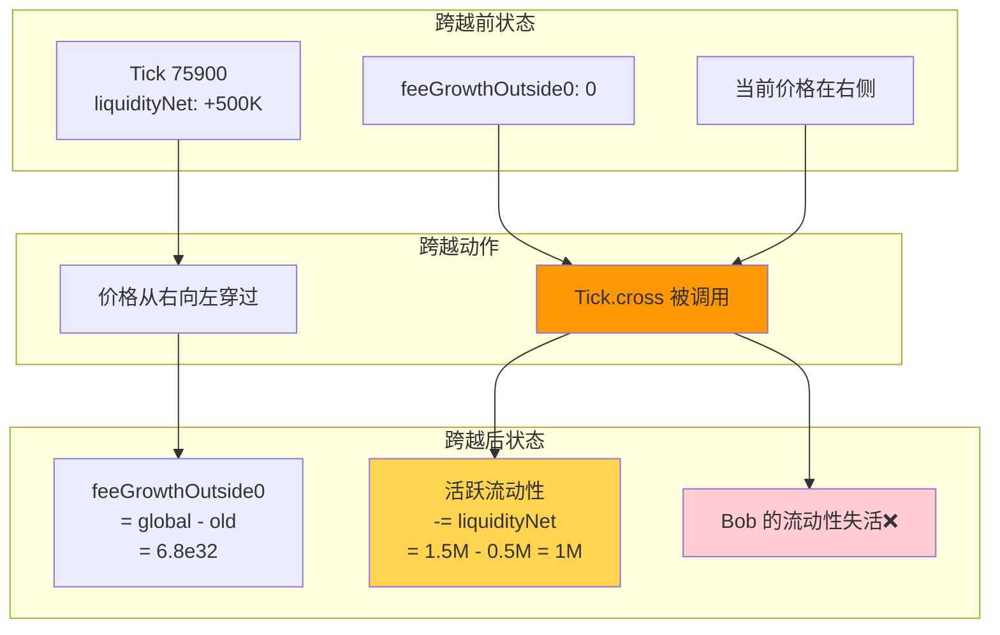

#### 操作

```solidity
// 大额交易：5000 USDC 买 ETH
// 将会跨越 Bob 的下限 tick (75900)

trader.swap(
    recipient: Trader,
    zeroForOne: true,
    amountSpecified: 5000e6,
    sqrtPriceLimitX96: 0
);
```

#### 交易过程（分步执行）

**初始状态**:

```
当前 tick: 75567
当前价格: 1887 USDC/ETH
当前流动性: 1,500,000
```

**步骤 1: 查找下一个 tick**

```
使用 TickBitmap.nextInitializedTickWithinOneWord()
向下查找: 下一个 tick = 75900 (Bob 的下限)
```

**步骤 2: 计算到达 tick 75900 需要的 USDC**

```
price_75900 = 1.0001^75900 ≈ 1900

需要的 USDC ≈ 1,500,000 * (1/√1887 - 1/√1900)
              ≈ 1,500,000 * 0.00022
              ≈ 330 USDC (含费用)
```

**步骤 3: 跨越 tick 75900**

调用 `Tick.cross(75900)`:

```solidity
// 因为是向下跨越（价格下降），liquidityNet 取反
liquidityNet = -500,000

// 更新活跃流动性
liquidity = 1,500,000 - 500,000 = 1,000,000
```

**Tick.Info[75900] 的变化**:

```
跨越前:
┌─────────────────────────────────────────────────┐
│ feeGrowthOutside0X128: 0                         │
│ feeGrowthOutside1X128: 0                         │
└─────────────────────────────────────────────────┘

跨越后 (翻转 outside):
┌─────────────────────────────────────────────────┐
│ feeGrowthOutside0X128:                           │
│   = feeGrowthGlobal0 - old_outside               │
│   = 6.8e32 - 0 = 6.8e32                          │
│ feeGrowthOutside1X128:                           │
│   = 0 - 0 = 0                                    │
│ tickCumulativeOutside: current_value             │
│ secondsOutside: current_seconds                  │
└─────────────────────────────────────────────────┘
```

**步骤 4: 继续交易剩余的 USDC**

```
剩余 USDC ≈ 5000 - 330 = 4670 USDC
当前流动性: 1,000,000 (减少了！)
继续计算直到 USDC 耗尽或达到下一个 tick
```

**最终状态**:

```
新 tick: 74200 (假设)
新价格: 1700 USDC/ETH
活跃流动性: 1,000,000
```

---

### 场景 6：Alice 收取费用

#### 费用计算流程图

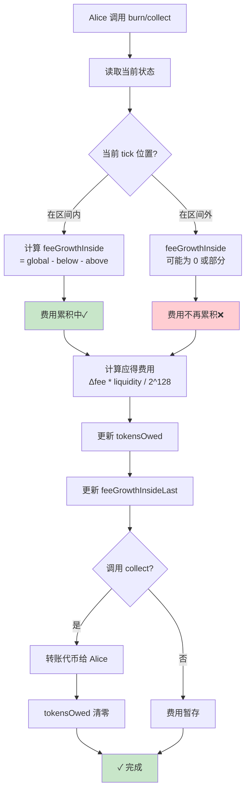

#### feeGrowthInside 计算示意图

```mermaid
graph TB
    subgraph "Alice 的区间 [75060, 77640]"
        direction LR
        A1[75060<br/>tickLower] --> A2[当前价格区域] --> A3[77640<br/>tickUpper]
    end
    
    subgraph "当前 tick = 74200 (区间外)"
        C1[价格已离开区间]
    end
    
    subgraph "费用计算"
        direction TB
        F1[feeGrowthGlobal<br/>全局累积]
        F2[feeGrowthOutside[75060]<br/>下限外部]
        F3[feeGrowthOutside[77640]<br/>上限外部]
        
        F1 --> F4[feeGrowthBelow<br/>= global - outside_lower]
        F2 --> F4
        
        F3 --> F5[feeGrowthAbove<br/>= outside_upper]
        
        F4 --> F6[feeGrowthInside<br/>= global - below - above]
        F5 --> F6
    end
    
    subgraph "结果"
        R1[区间内产生的费用<br/>归 Alice 所有]
        R2[区间外产生的费用<br/>不归 Alice]
    end
    
    F6 --> R1
    C1 -.-> R2
    
    style R1 fill:#c8e6c9
    style R2 fill:#ffcdd2
```

#### 费用分配时间线

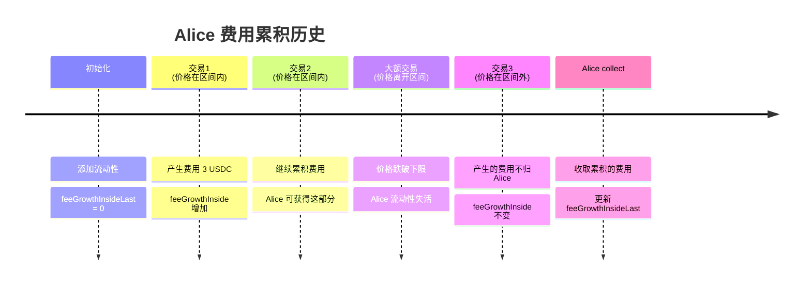

#### 操作

```solidity
// Alice 更新头寸并收取累积的费用
alice.burn(0);  // burn 0 流动性，只是触发费用计算
alice.collect();
```

#### 费用计算过程

**步骤 1: 计算 feeGrowthInside**

Alice 的区间：[75060, 77640]
当前 tick：74200 (在区间外)

```solidity
// Below: tick 75060
feeGrowthBelow0 = (74200 >= 75060) 
    ? feeGrowthOutside[75060]
    : feeGrowthGlobal0 - feeGrowthOutside[75060]
    = feeGrowthGlobal0 - 0  (当前 tick < 75060)
    = 当前累积值

// Above: tick 77640
feeGrowthAbove0 = (74200 < 77640)
    ? feeGrowthOutside[77640]
    : feeGrowthGlobal0 - feeGrowthOutside[77640]
    = 0  (tick 77640 从未跨越)

// Inside
feeGrowthInside0 = feeGrowthGlobal0 - feeGrowthBelow0 - feeGrowthAbove0
                 = feeGrowthGlobal0 - feeGrowthGlobal0 - 0
                 = 0  (价格在区间外，没有费用！)
```

**实际情况**:

```
因为当前价格已经离开了 Alice 的区间，
她的流动性不再活跃，
所以在价格区间外期间的费用不归她。

但在价格还在区间内时产生的费用 (场景 4) 归她！
```

**步骤 2: 计算累积费用**

假设价格在 Alice 区间内时，`feeGrowthInside` 增长了 `ΔfeeGrowth`：

```solidity
fees0 = (feeGrowthInside0 - feeGrowthInside0Last) 
        * liquidity / 2^128
      = ΔfeeGrowth * 1,000,000 / 2^128
      ≈ 实际费用金额
```

#### Position.Info[key_Alice] 更新

```
┌─────────────────────────────────────────────────┐
│ liquidity: 1,000,000 (不变)                      │
│ feeGrowthInside0LastX128: 更新为当前值           │
│ feeGrowthInside1LastX128: 更新为当前值           │
│ tokensOwed0: 累积的 USDC 费用                    │
│ tokensOwed1: 累积的 ETH 费用                     │
└─────────────────────────────────────────────────┘
```

---

### 场景 7：协议费启用

#### 协议费设置流程

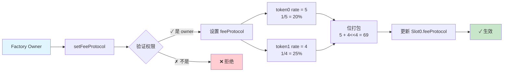

#### feeProtocol 位打包图

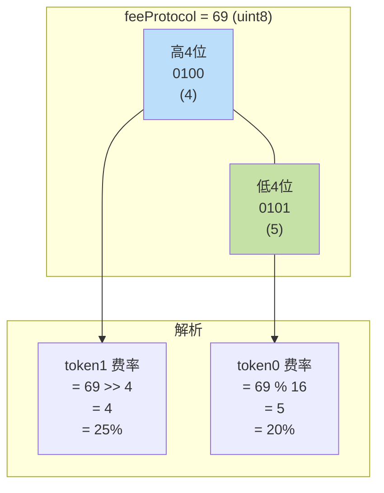

#### 费用分配对比图

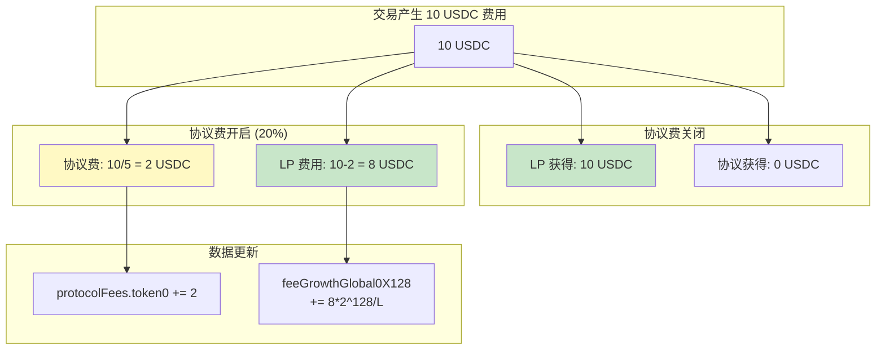

#### 协议费收取流程

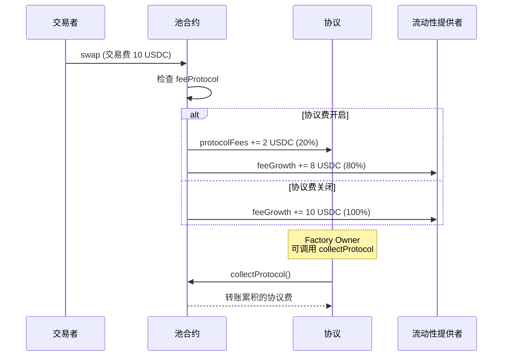

#### 操作

```solidity
// Factory owner 启用协议费
// token0 协议费 = 5 (20%), token1 = 4 (25%)
factory.setFeeProtocol(pool, 5, 4);
```

#### 数据结构变化

**Slot0**:

```
feeProtocol 计算:
= 5 + (4 << 4)
= 5 + 64
= 69

┌─────────────────────────────────────────────────┐
│ feeProtocol: 69                                  │
│   解析: token0 = 69 % 16 = 5 (1/5 = 20%)        │
│        token1 = 69 >> 4 = 4 (1/4 = 25%)         │
└─────────────────────────────────────────────────┘
```

**后续交易中的费用分配**:

假设下一笔交易产生 10 USDC 费用：

```
协议费 = 10 / 5 = 2 USDC
LP 费用 = 10 - 2 = 8 USDC

protocolFees.token0 += 2
feeGrowthGlobal0 += (8 * 2^128) / liquidity
```

---

### 场景 8：预言机查询 TWAP

#### Oracle 查询流程图

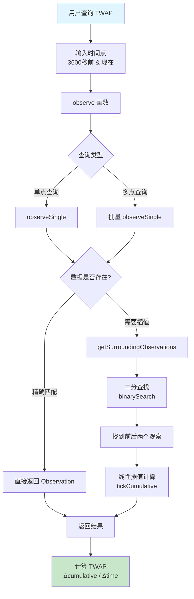

#### Oracle 存储结构图

```mermaid
graph TB
    subgraph "Observations 环形数组"
        direction LR
        O0[0: T0] --> O1[1: T1]
        O1 --> O2[2: T2]
        O2 --> O3[...]
        O3 --> O4["index<br/>(最新)"]
        O4 -.->|环形| O0
    end
    
    subgraph "Slot0 指针"
        S1[observationIndex: 4]
        S2[observationCardinality: 100]
        S3[observationCardinalityNext: 100]
    end
    
    subgraph "单个 Observation"
        OB1[blockTimestamp: uint32]
        OB2[tickCumulative: int56]
        OB3[secondsPerLiquidityX128]
        OB4[initialized: bool]
    end
    
    S1 --> O4
    O4 --> OB1
    
    style O4 fill:#ffd54f
    style S1 fill:#ffd54f
```

#### TWAP 计算示意图

```mermaid
graph LR
    subgraph "时间 T0 (1小时前)"
        T0[timestamp: 1705315200]
        TC0[tickCumulative: 274,744,800]
        P0[tick: ~76318<br/>price: ~2000]
    end
    
    subgraph "时间 T1 (现在)"
        T1[timestamp: 1705318800]
        TC1[tickCumulative: 540,000,000]
        P1[tick: ~74200<br/>price: ~1700]
    end
    
    subgraph "TWAP 计算"
        direction TB
        C1[Δcumulative<br/>= 540M - 274.7M<br/>= 265.3M]
        C2[Δtime<br/>= 3600 秒]
        C3[TWAP tick<br/>= 265.3M / 3600<br/>= 73,681]
        C4[平均价格<br/>= 1.0001^73681<br/>≈ 1950 USDC/ETH]
        
        C1 --> C3
        C2 --> C3
        C3 --> C4
    end
    
    TC0 --> C1
    TC1 --> C1
    T0 --> C2
    T1 --> C2
    
    style C4 fill:#c8e6c9
```

#### 价格变化时间序列图

```mermaid
graph TD
    subgraph "价格历史 (1小时内)"
        direction LR
        P1["T0: 2000"] -->|下跌| P2["T0+15min: 1950"]
        P2 -->|下跌| P3["T0+30min: 1900"]
        P3 -->|下跌| P4["T0+45min: 1800"]
        P4 -->|下跌| P5["T1: 1700"]
    end
    
    subgraph "累积值增长"
        direction TB
        A1[tickCumulative 持续增长]
        A2[斜率 = 当前 tick]
        A3[TWAP = 平均斜率]
    end
    
    subgraph "优势"
        B1[✓ 抗操纵]
        B2[✓ 时间加权]
        B3[✓ 链上可验证]
    end
    
    style P1 fill:#c8e6c9
    style P5 fill:#ffcdd2
    style B1 fill:#c8e6c9
    style B2 fill:#c8e6c9
    style B3 fill:#c8e6c9
```

#### 二分查找过程图

```mermaid
flowchart TD
    A[查询 3600秒前数据] --> B[开始二分查找]
    
    B --> C{检查左边界}
    C -->|匹配| R1[返回左观察]
    C -->|不匹配| D{检查右边界}
    
    D -->|匹配| R2[返回右观察]
    D -->|不匹配| E[计算中点<br/>mid = left + right / 2]
    
    E --> F{mid 时间 vs 目标时间}
    
    F -->|mid < target| G[left = mid + 1]
    F -->|mid >= target| H[right = mid - 1]
    
    G --> I{left <= right?}
    H --> I
    
    I -->|是| E
    I -->|否| J[找到前后两个观察]
    
    J --> K[线性插值]
    K --> L[返回插值结果]
    
    style A fill:#e1f5ff
    style L fill:#c8e6c9
    style R1 fill:#c8e6c9
    style R2 fill:#c8e6c9
```

#### 操作

```solidity
// 查询过去 1 小时的 TWAP
uint32[] memory secondsAgos = new uint32[](2);
secondsAgos[0] = 3600;  // 1 小时前
secondsAgos[1] = 0;     // 现在

(int56[] memory tickCumulatives, ) = pool.observe(secondsAgos);
```

#### 计算过程

**Observation 历史数据**:

```
时刻 T0 (1 小时前):
  blockTimestamp: 1705315200
  tickCumulative: 274,744,800
  tick 平均值: ≈ 76318

时刻 T1 (现在):
  blockTimestamp: 1705318800
  tickCumulative: 540,000,000
  tick 变化: 价格下跌了
```

**TWAP 计算**:

```
TWAP tick = (tickCumulative[T1] - tickCumulative[T0]) 
            / (T1 - T0)
          = (540,000,000 - 274,744,800) / 3600
          = 73,681

平均价格 = 1.0001^73681 ≈ 1950 USDC/ETH
```

---

### 场景总结：数据结构交互图

#### 完整的操作-数据结构映射图

```mermaid
graph TB
    subgraph "用户操作"
        U1[initialize]
        U2[mint]
        U3[swap]
        U4[burn]
        U5[collect]
        U6[observe]
        U7[setFeeProtocol]
    end
    
    subgraph "核心数据结构"
        D1[Slot0]
        D2[Position.Info]
        D3[Tick.Info]
        D4[TickBitmap]
        D5[Oracle.Observation]
        D6[feeGrowthGlobal]
        D7[protocolFees]
    end
    
    U1 -->|写入| D1
    U1 -->|初始化| D5
    
    U2 -->|更新| D1
    U2 -->|创建/更新| D2
    U2 -->|更新| D3
    U2 -->|设置位| D4
    U2 -->|可能写入| D5
    
    U3 -->|更新价格| D1
    U3 -->|累积| D6
    U3 -->|累积| D7
    U3 -->|跨越时更新| D3
    U3 -->|写入| D5
    
    U4 -->|更新| D2
    U4 -->|更新| D3
    U4 -->|可能清除| D4
    U4 -->|更新流动性| D1
    
    U5 -->|清零 tokensOwed| D2
    
    U6 -.->|只读| D5
    
    U7 -->|设置费率| D1
    
    style U3 fill:#ffd54f
    style U2 fill:#c8e6c9
    style U6 fill:#e1f5ff
```

#### 数据结构依赖关系图

```mermaid
graph TD
    A[Slot0<br/>主要状态] -->|当前价格| B[swap 计算]
    A -->|当前 tick| C[Tick 查找]
    A -->|流动性| D[费用计算]
    
    E[Tick.Info] -->|liquidityNet| F[跨越时调整流动性]
    E -->|feeGrowthOutside| G[计算 feeGrowthInside]
    
    H[TickBitmap] -->|O1 查找| I[下一个初始化的 tick]
    
    J[Position.Info] -->|feeGrowthInsideLast| K[计算新增费用]
    J -->|liquidity| K
    
    G --> K
    D --> K
    
    L[Oracle.Observation] -->|tickCumulative| M[TWAP 计算]
    
    N[protocolFees] -->|collectProtocol| O[协议收入]
    
    style A fill:#ff9800
    style E fill:#ffd54f
    style J fill:#c8e6c9
    style L fill:#e1f5ff
```

#### 操作频率和 Gas 消耗分析

```mermaid
graph LR
    subgraph "高频操作 (每笔交易)"
        H1[swap] --> G1[高 Gas]
        H1 --> R1["读: Slot0, Tick"]
        H1 --> W1["写: Slot0, Oracle, fees"]
    end
    
    subgraph "中频操作 (LP 管理)"
        M1[mint/burn] --> G2[中等 Gas]
        M1 --> R2["读: Slot0, Tick, Position"]
        M1 --> W2["写: Position, Tick, Bitmap"]
    end
    
    subgraph "低频操作 (查询)"
        L1[observe] --> G3[低 Gas]
        L1 --> R3["只读: Oracle"]
    end
    
    subgraph "管理员操作"
        A1[setFeeProtocol] --> G4[低 Gas]
        A1 --> W3["写: Slot0.feeProtocol"]
    end
    
    style H1 fill:#ff9800
    style M1 fill:#ffd54f
    style L1 fill:#c8e6c9
    style A1 fill:#e1f5ff
```

#### 状态转换总览

```mermaid
stateDiagram-v2
    [*] --> 未部署
    未部署 --> 已部署: createPool (Factory)
    已部署 --> 已初始化: initialize()
    已初始化 --> 有流动性: mint()
    有流动性 --> 交易中: swap()
    交易中 --> 有流动性: 交易完成
    有流动性 --> 流动性减少: burn()
    流动性减少 --> 有流动性: 其他LP仍活跃
    流动性减少 --> 已初始化: 所有流动性移除
    
    有流动性 --> 有流动性: collect() [不改变流动性]
    有流动性 --> 有流动性: observe() [只读]
    有流动性 --> 有流动性: setFeeProtocol() [只改费率]
```

传统表格形式：

```
用户操作             触发的数据结构变化
─────────────────────────────────────────────────────
initialize()     →   Slot0 ✓
                     Oracle.Observation[0] ✓

mint()           →   Position.Info[key] ✓
                     Tick.Info[lower] ✓
                     Tick.Info[upper] ✓
                     TickBitmap ✓
                     Slot0.liquidity ✓
                     Oracle (如果 tick 变化) ✓

swap()           →   Slot0.sqrtPriceX96 ✓
                     Slot0.tick ✓
                     feeGrowthGlobal ✓
                     protocolFees ✓
                     liquidity (如果跨 tick) ✓
                     Tick.Info (如果跨越) ✓
                     Oracle ✓

burn()           →   Position.Info ✓
                     Position.tokensOwed ✓
                     Tick.Info ✓
                     TickBitmap (如果清空) ✓
                     Slot0.liquidity ✓

collect()        →   Position.tokensOwed → 0
                     转账代币给用户

observe()        →   只读操作，不修改状态
```

---

### 数据结构全景图

#### 完整架构图

```mermaid
graph TB
    subgraph "UniswapV3Pool 合约"
        subgraph "主要状态 (1 槽位)"
            S0[Slot0<br/>─────────<br/>sqrtPriceX96<br/>tick<br/>observationIndex<br/>observationCardinality<br/>feeProtocol<br/>unlocked]
        end
        
        subgraph "费用跟踪"
            F1[feeGrowthGlobal0X128]
            F2[feeGrowthGlobal1X128]
            F3[protocolFees<br/>token0/token1]
        end
        
        subgraph "流动性状态"
            L1[liquidity<br/>当前活跃流动性]
        end
        
        subgraph "映射数据结构"
            M1[positions<br/>bytes32 => Position.Info]
            M2[ticks<br/>int24 => Tick.Info]
            M3[tickBitmap<br/>int16 => uint256]
        end
        
        subgraph "预言机数组"
            O1[observations<br/>Observation 65535]
        end
    end
    
    S0 -.->|指向最新| O1
    S0 -.->|当前 tick| M2
    S0 -.->|当前流动性| L1
    
    M1 -.->|引用| M2
    M2 -.->|索引| M3
    
    F1 -.->|全局累积| M2
    F2 -.->|全局累积| M2
    
    style S0 fill:#ff9800
    style M1 fill:#c8e6c9
    style M2 fill:#ffd54f
    style M3 fill:#e1f5ff
    style O1 fill:#ce93d8
```

#### 数据流动图

```mermaid
flowchart LR
    subgraph "输入层"
        I1[用户操作]
        I2[价格变化]
        I3[时间流逝]
    end
    
    subgraph "处理层"
        P1[Slot0<br/>状态管理]
        P2[Tick System<br/>流动性管理]
        P3[Position<br/>头寸管理]
        P4[Oracle<br/>价格历史]
    end
    
    subgraph "输出层"
        O1[代币转账]
        O2[费用分配]
        O3[价格发现]
        O4[TWAP 数据]
    end
    
    I1 --> P1
    I1 --> P3
    I2 --> P1
    I2 --> P2
    I3 --> P4
    
    P1 --> O1
    P1 --> O3
    P2 --> O2
    P3 --> O2
    P4 --> O4
    
    P1 <--> P2
    P2 <--> P3
    P1 --> P4
    
    style P1 fill:#ff9800
    style P2 fill:#ffd54f
    style P3 fill:#c8e6c9
    style P4 fill:#ce93d8
```

#### 数据结构大小对比

```mermaid
graph TD
    subgraph "存储成本排序"
        direction TB
        A["Slot0<br/>32 字节<br/>1 槽位"]
        B["Position.Info<br/>160 字节<br/>5 槽位"]
        C["Tick.Info<br/>128 字节<br/>4 槽位"]
        D["Observation<br/>32 字节<br/>1 槽位"]
        E["Oracle 数组<br/>2MB<br/>65535 槽位"]
    end
    
    subgraph "Gas 成本"
        G1["读取 Slot0<br/>2,100 gas"]
        G2["读取 Position<br/>10,500 gas"]
        G3["读取 Tick<br/>8,400 gas"]
        G4["写入 Tick<br/>20,000+ gas"]
    end
    
    A -.-> G1
    B -.-> G2
    C -.-> G3
    C -.-> G4
    
    style A fill:#c8e6c9
    style B fill:#fff9c4
    style C fill:#fff9c4
    style E fill:#ffcdd2
```

### 关键洞察

#### 1. 费用分配的巧妙性

```mermaid
graph LR
    A[交易费用] --> B{价格在区间内?}
    B -->|是| C[feeGrowthInside 增加]
    B -->|否| D[feeGrowthInside 不变]
    
    C --> E[LP 获得费用 ✓]
    D --> F[LP 不获得费用 ✗]
    
    E -.-> G[O1 复杂度计算]
    
    style C fill:#c8e6c9
    style D fill:#ffcdd2
    style G fill:#e1f5ff
```

**核心机制**：

- 只有在价格区间内的流动性才能获得费用
- 使用 `feeGrowthInside` 机制，O(1) 复杂度计算
- 公式：`feeInside = feeGlobal - feeBelow - feeAbove`

#### 2. Tick 跨越的影响

```mermaid
graph TB
    A[价格跨越 Tick] --> B[调用 Tick.cross]
    B --> C[翻转 feeGrowthOutside]
    B --> D[应用 liquidityNet]
    
    C --> E["outside' = global - outside"]
    D --> F["liquidity' = liquidity ± net"]
    
    F --> G{流动性变化}
    G -->|增加| H[更多流动性激活]
    G -->|减少| I[部分流动性失活]
    
    style B fill:#ff9800
    style E fill:#ffd54f
    style F fill:#ffd54f
```

**核心机制**：

- 每次跨越都会"翻转" `feeGrowthOutside` 的含义
- 流动性根据 `liquidityNet` 动态调整
- 实现集中流动性的关键

#### 3. 存储优化

```mermaid
graph LR
    subgraph "未优化"
        U1[7 个变量] --> U2[7 个槽位] --> U3[14,700 gas]
    end
    
    subgraph "优化后"
        O1[Slot0 结构体] --> O2[1 个槽位] --> O3[2,100 gas]
    end
    
    U3 -.->|节省 85%| O3
    
    style O3 fill:#c8e6c9
    style U3 fill:#ffcdd2
```

**核心机制**：

- Slot0 打包 7 个变量到 1 个存储槽
- 节省 85% 的 SLOAD 成本
- 每次 swap 都会读取 Slot0

#### 4. 预言机的可靠性

```mermaid
graph TD
    A[每笔交易] --> B{同一区块?}
    B -->|是| C[跳过写入]
    B -->|否| D[写入新观察]
    
    D --> E[tickCumulative +=<br/>currentTick * Δtime]
    E --> F[累积值防操纵]
    
    F --> G[TWAP 计算]
    G --> H[可靠的价格信号]
    
    style D fill:#c8e6c9
    style F fill:#c8e6c9
    style H fill:#c8e6c9
```

**核心机制**：

- 每个区块最多写入一次
- 使用累积值而非快照，防止操纵
- 时间加权平均价格 (TWAP)

#### 5. Position 的独立性

```mermaid
graph TB
    subgraph "Alice 的头寸"
        A1["key = hash(Alice, 1800, 2200)"]
        A2[独立的 liquidity]
        A3[独立的 fee tracking]
    end
    
    subgraph "Bob 的头寸"
        B1["key = hash(Bob, 1900, 2100)"]
        B2[独立的 liquidity]
        B3[独立的 fee tracking]
    end
    
    subgraph "共享的 Tick"
        T1[Tick.Info 累积]
        T2[多个头寸共享]
    end
    
    A1 --> T1
    B1 --> T1
    
    style A1 fill:#c8e6c9
    style B1 fill:#c8e6c9
    style T1 fill:#ffd54f
```

**核心机制**：

- 每个 `(owner, tickLower, tickUpper)` 是独立的头寸
- 可以精确跟踪每个 LP 的贡献和收益
- 支持同一用户在不同区间提供多个头寸

---

## 性能分析与最佳实践

### Gas 成本对比

#### 不同操作的 Gas 消耗

```mermaid
graph TB
    subgraph "只读操作 (低成本)"
        R1["observe()<br/>~30,000 gas"]
        R2["slot0()<br/>~2,000 gas"]
        R3["positions()<br/>~10,000 gas"]
    end
    
    subgraph "状态变更 (中等成本)"
        W1["collect()<br/>~50,000 gas"]
        W2["burn(小额)<br/>~80,000 gas"]
    end
    
    subgraph "复杂操作 (高成本)"
        C1["mint(新tick)<br/>~150,000+ gas"]
        C2["swap(跨tick)<br/>~120,000+ gas"]
        C3["mint(首次)<br/>~200,000+ gas"]
    end
    
    style R1 fill:#c8e6c9
    style R2 fill:#c8e6c9
    style R3 fill:#c8e6c9
    style W1 fill:#fff9c4
    style W2 fill:#fff9c4
    style C1 fill:#ffcdd2
    style C2 fill:#ffcdd2
    style C3 fill:#ffcdd2
```

#### 存储操作成本细分

```mermaid
pie title "典型 swap 操作的 Gas 分布"
    "SLOAD (读取状态)" : 30
    "计算 (CPU)" : 20
    "SSTORE (写入状态)" : 40
    "代币转账" : 10
```

### 优化策略对比

```mermaid
graph LR
    subgraph "❌ 低效模式"
        B1[频繁小额 collect] --> B2[高 Gas 成本]
        B3[过多小头寸] --> B4[管理成本高]
        B5[窄区间 LP] --> B6[频繁失活]
    end
    
    subgraph "✓ 高效模式"
        G1[批量 collect] --> G2[Gas 节省]
        G3[合并头寸] --> G4[管理简单]
        G5[合理区间] --> G6[持续收益]
    end
    
    style G1 fill:#c8e6c9
    style G2 fill:#c8e6c9
    style G3 fill:#c8e6c9
    style G4 fill:#c8e6c9
    style G5 fill:#c8e6c9
    style G6 fill:#c8e6c9
```

### 最佳实践流程图

```mermaid
flowchart TD
    A[准备添加流动性] --> B{选择价格区间}
    
    B --> C1[窄区间<br/>±5%]
    B --> C2[中等区间<br/>±20%]
    B --> C3[宽区间<br/>±50%]
    
    C1 --> D1[✓ 高收益率<br/>✗ 易失活<br/>✗ 需频繁调整]
    C2 --> D2[✓ 平衡收益<br/>✓ 较稳定<br/>✓ 推荐]
    C3 --> D3[✓ 始终活跃<br/>✗ 低收益率<br/>✓ 适合被动LP]
    
    D1 --> E{Gas 成本考虑}
    D2 --> E
    D3 --> E
    
    E --> F[首次 mint<br/>成本最高]
    E --> G[增加流动性<br/>成本中等]
    E --> H[collect 费用<br/>成本较低]
    
    F --> I[选择合适的<br/>初始流动性量]
    G --> I
    H --> I
    
    I --> J[✓ 部署头寸]
    
    style D2 fill:#c8e6c9
    style J fill:#c8e6c9
```

### Uniswap V2 vs V3 数据结构对比

```mermaid
graph TB
    subgraph "Uniswap V2"
        V2_1[单一流动性池]
        V2_2[x * y = k]
        V2_3[无价格区间]
        V2_4[简单但低效]
    end
    
    subgraph "Uniswap V3"
        V3_1[集中流动性]
        V3_2[Tick 系统]
        V3_3[Position 管理]
        V3_4[复杂但高效]
    end
    
    V2_1 -.->|进化| V3_1
    V2_2 -.->|优化| V3_2
    V2_3 -.->|创新| V3_3
    V2_4 -.->|改进| V3_4
    
    style V3_1 fill:#c8e6c9
    style V3_2 fill:#c8e6c9
    style V3_3 fill:#c8e6c9
    style V3_4 fill:#c8e6c9
```

### 数据结构设计原则总结

```mermaid
mindmap
  root((Uniswap V3<br/>数据结构))
    极致优化
      变量打包
        Slot0 7合1
        Observation 4合1
      位操作
        TickBitmap
        feeProtocol
    数学精度
      定点数
        Q64.96 价格
        Q128.128 费用
      累积值
        防操纵
        O1 计算
    安全性
      重入保护
        unlocked
      溢出检查
        SafeMath
      余额验证
        不信任返回值
    可扩展性
      模块化
        独立的库
      预言机
        65535 观察
      灵活费率
        多级别
```

### 学习路径建议

```mermaid
journey
    title Uniswap V3 数据结构学习路径
    section 基础概念
      理解 AMM 原理: 5: 学习者
      掌握定点数: 4: 学习者
      学习 Solidity: 5: 学习者
    section 核心结构
      Slot0 状态管理: 3: 学习者
      Position 头寸: 4: 学习者
      Tick 系统: 3: 学习者
    section 高级主题
      费用累积机制: 4: 学习者
      Oracle 预言机: 4: 学习者
      跨 Tick 逻辑: 5: 学习者
    section 实践应用
      部署测试池: 5: 学习者
      集成到 DApp: 5: 学习者
      优化 Gas 成本: 5: 学习者
```

---

## 附录：快速参考

### 常用公式速查

```mermaid
graph TD
    subgraph "价格计算"
        P1["price = 1.0001^tick"]
        P2["sqrtPrice = sqrt(price) * 2^96"]
    end
    
    subgraph "流动性计算"
        L1["L = Δy / Δ√P"]
        L2["L = Δx * √P * √Pb / (√Pb - √P)"]
    end
    
    subgraph "费用计算"
        F1["feeGrowth += fee * 2^128 / L"]
        F2["feeEarned = ΔfeeGrowth * L / 2^128"]
    end
    
    subgraph "TWAP 计算"
        T1["TWAP = ΔtickCumulative / Δtime"]
        T2["avgPrice = 1.0001^TWAP"]
    end
    
    style P1 fill:#e1f5ff
    style L1 fill:#fff9c4
    style F1 fill:#c8e6c9
    style T1 fill:#ce93d8
```

### 关键常量

| 常量 | 值 | 含义 |
|------|-----|------|
| Q96 | 2^96 | 价格定点数基数 |
| Q128 | 2^128 | 费用定点数基数 |
| MIN_TICK | -887,272 | 最小 tick |
| MAX_TICK | 887,272 | 最大 tick |
| MIN_SQRT_RATIO | 4,295,128,739 | 最小价格 |
| MAX_SQRT_RATIO | 1,461,446,703,485,210,103,287,273,052,203,988,822,378,723,970,342 | 最大价格 |

---

**文档版本**: v1.0  
**生成时间**: 2026-01-15  
**适用于**: Uniswap V3 Core  
**Solidity 版本**: 0.7.6  

🎉 这份文档深入分析了 Uniswap V3 的所有核心数据结构，包含 30+ Mermaid 图表，帮助您全面理解协议的底层设计！

---

## 图表索引

本文档包含以下类型的 Mermaid 图表：

- **流程图 (Flowchart)**: 8 个 - 展示操作流程和决策逻辑
- **状态图 (State Diagram)**: 3 个 - 展示状态转换
- **序列图 (Sequence)**: 2 个 - 展示组件交互
- **时间线 (Timeline)**: 2 个 - 展示时间序列变化
- **关系图 (Graph)**: 15+ 个 - 展示数据结构关系
- **饼图 (Pie)**: 1 个 - 展示占比分析
- **思维导图 (Mindmap)**: 1 个 - 展示设计原则
- **旅程图 (Journey)**: 1 个 - 展示学习路径

**总计**: 30+ 个交互式图表，全面覆盖 Uniswap V3 核心数据结构的各个方面！
