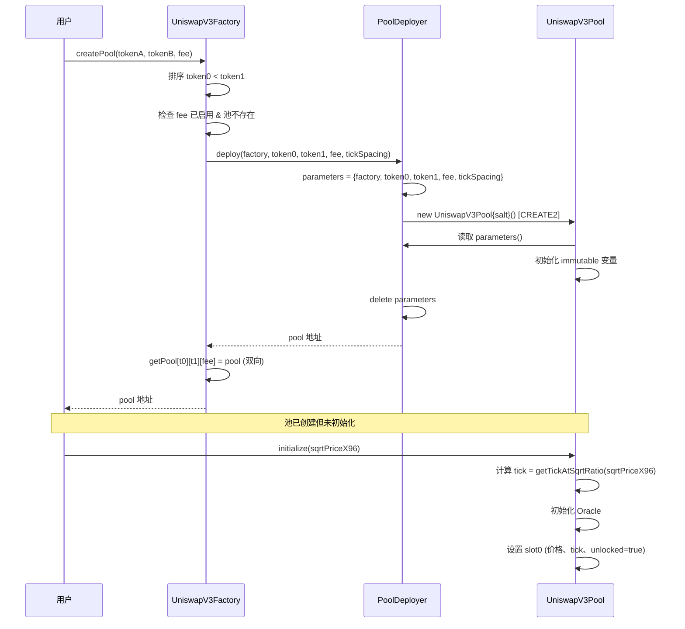
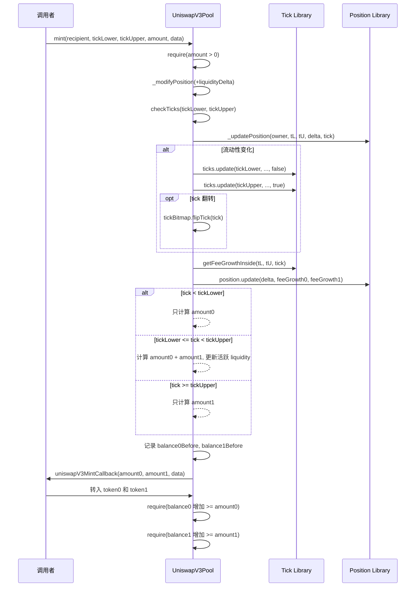
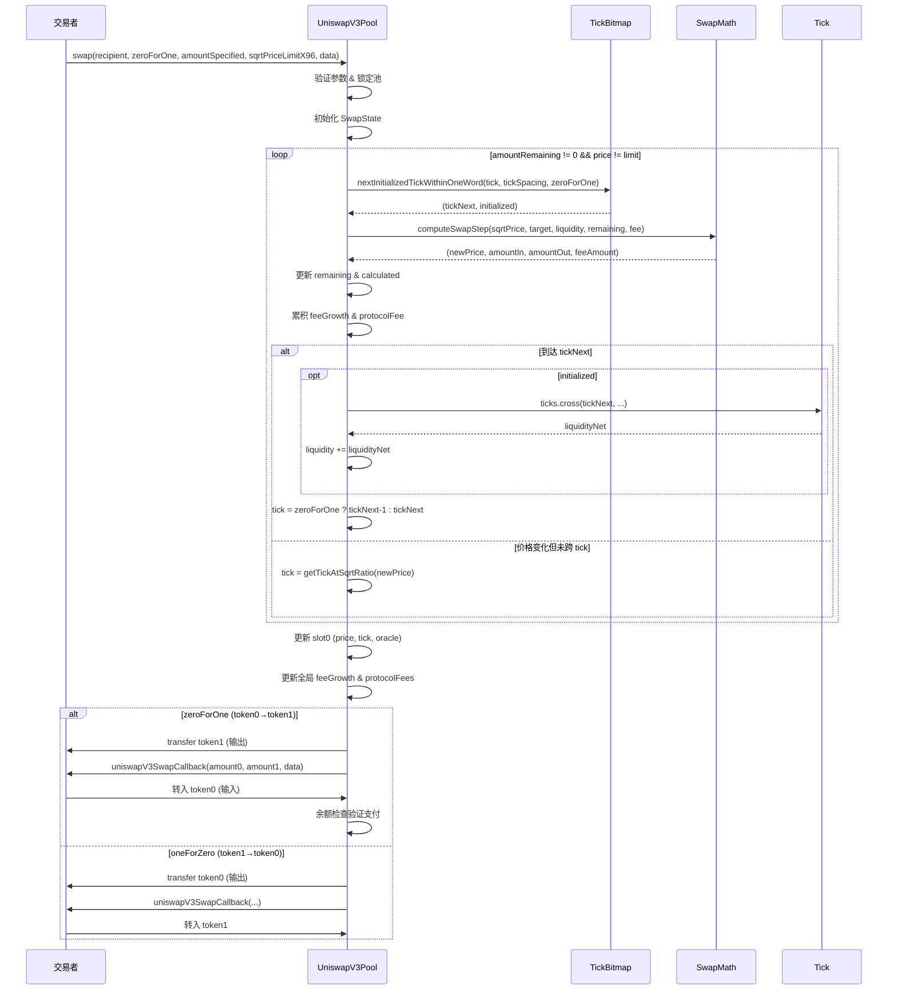

# Uniswap V3 Core 源码全面分析报告

---

## 1. 概述

Uniswap V3 Core 是 Uniswap 去中心化交易所的第三代核心协议，于 2021 年发布。其核心创新是 **集中流动性 (Concentrated Liquidity)**，允许流动性提供者 (LP) 将资金集中在自定义的价格区间内，而非像 V2 一样均匀分布在整个价格范围。此外还引入了多级费率、改进的链上预言机 (TWAP Oracle) 和 `noDelegateCall` 安全机制。合约使用 Solidity 0.7.6 编译，采用 BUSL-1.1 商业源码许可证。

---

## 2. 架构概览

### 2.1 合约关系图

```mermaid
graph TD
    subgraph 核心合约
        Factory[UniswapV3Factory] -->|继承| Deployer[UniswapV3PoolDeployer]
        Factory -->|继承| NDC[NoDelegateCall]
        Factory -->|CREATE2 部署| Pool[UniswapV3Pool]
        Pool -->|继承| NDC
        Pool -->|实现| IPool[IUniswapV3Pool]
        Deployer -->|实现| IDeployer[IUniswapV3PoolDeployer]
        Factory -->|实现| IFactory[IUniswapV3Factory]
    end

    subgraph 接口层
        IPool -->|组合| IImmutables[IUniswapV3PoolImmutables]
        IPool -->|组合| IState[IUniswapV3PoolState]
        IPool -->|组合| IDerived[IUniswapV3PoolDerivedState]
        IPool -->|组合| IActions[IUniswapV3PoolActions]
        IPool -->|组合| IOwnerActions[IUniswapV3PoolOwnerActions]
        IPool -->|组合| IEvents[IUniswapV3PoolEvents]
    end

    subgraph 库合约
        Pool -->|使用| TickLib[Tick]
        Pool -->|使用| TickBitmap[TickBitmap]
        Pool -->|使用| PositionLib[Position]
        Pool -->|使用| OracleLib[Oracle]
        Pool -->|使用| SwapMathLib[SwapMath]
        Pool -->|使用| SqrtPriceMathLib[SqrtPriceMath]
        Pool -->|使用| FullMathLib[FullMath]
        Pool -->|使用| TickMathLib[TickMath]
        Pool -->|使用| TransferHelperLib[TransferHelper]
        Pool -->|使用| LowGasSafeMathLib[LowGasSafeMath]
        Pool -->|使用| SafeCastLib[SafeCast]
        Pool -->|使用| LiquidityMathLib[LiquidityMath]
        TickBitmap -->|使用| BitMathLib[BitMath]
        SqrtPriceMathLib -->|使用| UnsafeMathLib[UnsafeMath]
        SqrtPriceMathLib -->|使用| FixedPoint96Lib[FixedPoint96]
        Pool -->|使用| FixedPoint128Lib[FixedPoint128]
    end

    subgraph 回调接口
        Pool -.->|回调| MintCB[IUniswapV3MintCallback]
        Pool -.->|回调| SwapCB[IUniswapV3SwapCallback]
        Pool -.->|回调| FlashCB[IUniswapV3FlashCallback]
    end
```



### 2.2 存储布局

```
Storage Layout: UniswapV3Pool
══════════════════════════════════════════════════════════════
Slot  | Type                          | Variable                    | 来源
──────┼───────────────────────────────┼─────────────────────────────┼────────────
0     | struct Slot0 (packed 256-bit) | slot0                       | Pool
      |   uint160                     |   sqrtPriceX96              |
      |   int24                       |   tick                      |
      |   uint16                      |   observationIndex          |
      |   uint16                      |   observationCardinality    |
      |   uint16                      |   observationCardinalityNext|
      |   uint8                       |   feeProtocol               |
      |   bool                        |   unlocked                  |
1     | uint256                       | feeGrowthGlobal0X128        | Pool
2     | uint256                       | feeGrowthGlobal1X128        | Pool
3     | struct ProtocolFees (packed)   | protocolFees                | Pool
      |   uint128                     |   token0                    |
      |   uint128                     |   token1                    |
4     | uint128                       | liquidity                   | Pool
5+    | mapping(int24 => Tick.Info)    | ticks                       | Pool
6+    | mapping(int16 => uint256)      | tickBitmap                  | Pool
7+    | mapping(bytes32 => Position.Info)| positions                 | Pool
8+    | Oracle.Observation[65535]      | observations                | Pool
──────┴───────────────────────────────┴─────────────────────────────┴────────────

immutable (存储在字节码中):
      | address                       | factory                     | Pool
      | address                       | token0                      | Pool
      | address                       | token1                      | Pool
      | uint24                        | fee                         | Pool
      | int24                         | tickSpacing                 | Pool
      | uint128                       | maxLiquidityPerTick          | Pool
      | address                       | original                    | NoDelegateCall
```

**关键设计**：`Slot0` 将 7 个关键状态变量打包到一个 256 位存储槽中，一次 `SLOAD` 即可读取全部，显著节省 gas。

### 2.3 权限模型

```
权限模型: Uniswap V3 Core
═══════════════════════════════════════════════════════════
角色/地址          | 能力                               | 设置方式
──────────────────┼────────────────────────────────────┼──────────────
Factory.owner     | setOwner, enableFeeAmount           | constructor → setOwner()
                  | setFeeProtocol, collectProtocol     | (通过 Pool 的 onlyFactoryOwner)
Any (任何人)       | createPool                         | 无限制
                  | initialize (仅一次)                  | 无限制
                  | mint / burn / collect               | 无限制 (burn/collect 限 position owner)
                  | swap / flash                        | 无限制
                  | increaseObservationCardinalityNext  | 无限制
                  | observe / snapshotCumulativesInside  | 无限制 (view)
```

**要点**：
- 系统中唯一的特权角色是 `Factory.owner`，拥有设置协议费和启用新费率的权限
- 所有交易类操作 (swap/mint/burn/flash) 对任何人开放
- `burn` 和 `collect` 通过 `positions.get(msg.sender, ...)` 隐式限制为头寸所有者

---

## 3. 核心流程分析

### 3.1 池创建流程 (createPool + initialize)



**设计亮点**：
- 使用 CREATE2 部署，池地址可确定性计算
- deployer 的 `parameters` 临时存储模式避免了构造函数参数传递
- `initialize` 与 `createPool` 分离，允许不同的调用者

### 3.2 添加流动性 (mint)



### 3.3 交易流程 (swap) — 核心算法



**swap 算法核心要点**：
1. **逐 tick 步进**：每个循环找到下一个已初始化的 tick，计算在当前流动性下能交易多少
2. **tick 跨越**：当价格跨过一个 tick 边界时，从 `Tick.Info.liquidityNet` 获取流动性净变化
3. **先转出后回调**：输出代币先转给接收者，然后通过回调要求输入代币，最后做余额检查

### 3.4 闪电贷 (flash)

```
执行流程:
1. require(liquidity > 0)
2. 计算费用: fee = amount * fee / 1e6 (向上取整)
3. 记录 balanceBefore
4. 转出借款代币给 recipient
5. 回调: uniswapV3FlashCallback(fee0, fee1, data)
6. 验证: balanceAfter >= balanceBefore + fee
7. 分配费用: protocolFee + feeGrowthGlobal (LP 费用)
```

### 3.5 预言机 (Oracle/TWAP)

**数据结构**：环形数组 `Observation[65535]`，每个观察记录包含:
- `blockTimestamp` (uint32)
- `tickCumulative` (int56) — tick 的时间加权累积
- `secondsPerLiquidityCumulativeX128` (uint160) — 流动性的时间加权

**TWAP 计算**：

```
TWAP_{[t1, t2]} = (tickCumulative(t2) - tickCumulative(t1)) / (t2 - t1)
```

然后 `price = 1.0001^TWAP`

**查询机制**：`observe(secondsAgos[])` 通过二分搜索 `binarySearch` 在环形数组中定位目标时间点，支持线性插值。

---

## 4. DeFi 机制分析 — 集中流动性数学模型

### 4.1 定价公式

Uniswap V3 使用 **平方根价格** 作为核心状态变量：

```
sqrt(P) = sqrt(token1 / token0)
```

存储格式为 Q64.96 定点数 `sqrtPriceX96 = sqrt(P) * 2^96`。

### 4.2 tick 系统

每个 tick 代表一个离散价格点：

```
P(i) = 1.0001^i
```

tick 范围: `[-887272, +887272]`，覆盖价格范围 `[2^-128, 2^128]`。

### 4.3 集中流动性的代币数量计算

当 LP 提供流动性 L 在价格区间 `[sqrt(Pa), sqrt(Pb)]` 内：

**当前价格 sqrt(P) 在区间内** (`Pa <= P <= Pb`)：

```
Δx = L * (1/sqrt(P) - 1/sqrt(Pb))
Δy = L * (sqrt(P) - sqrt(Pa))
```

**价格低于区间** (`P < Pa`)：仅需 token0

```
Δx = L * (1/sqrt(Pa) - 1/sqrt(Pb))
```

**价格高于区间** (`P > Pb`)：仅需 token1

```
Δy = L * (sqrt(Pb) - sqrt(Pa))
```

### 4.4 费用累积机制

全局费用增长（每单位流动性），使用 Q128 定点数：

```
feeGrowthGlobal += (feeAmount * 2^128) / liquidity
```

LP 应得费用 = 区间内费用增长差值 × LP 的流动性 / 2^128。

费用增长的"inside/outside"分离使用 tick 边界的翻转技巧：
- 每个 tick 存储 `feeGrowthOutside`
- 当 tick 被跨越时：`feeGrowthOutside = feeGrowthGlobal - feeGrowthOutside`（翻转）
- 区间内费用 = `feeGrowthGlobal - feeGrowthBelow - feeGrowthAbove`

### 4.5 经济安全分析

| 维度 | 评估 |
|------|------|
| **套利均衡** | tick 系统天然支持套利者将价格推至市场均衡；集中流动性使滑点更低 |
| **无常损失** | 集中流动性放大了无常损失——区间越窄，当价格出区间时损失越大 |
| **极端行情** | 当价格超出所有流动性区间时，`liquidity = 0`，交易自然停止（不会错误定价） |
| **MEV 风险** | swap 先转出再回调的模式天然暴露给三明治攻击；`sqrtPriceLimitX96` 提供部分保护 |
| **预言机操纵** | TWAP 需要在多个区块内操纵，成本高；但短周期 TWAP 仍有风险 |

---

## 5. 安全审计发现

### [S-01] 重入保护设计完善

**严重级别**: Informational（正面发现）
**位置**: `UniswapV3Pool.lock()` modifier
**类别**: 重入

`lock()` 修饰符通过 `slot0.unlocked` 标志提供重入保护。`swap()` 函数手动管理锁状态而非使用修饰符，但逻辑等价。所有 external 写操作均受保护。

### [S-02] `flash()` 中 `require(liquidity > 0)` 的含义

**严重级别**: Low
**位置**: `UniswapV3Pool.flash()` @ contracts/UniswapV3Pool.sol:1199
**类别**: 逻辑

**描述**：`flash()` 要求 `liquidity > 0` 才能执行闪电贷。当池中没有活跃流动性时，闪电贷费用无法分配给 LP（分母为 0），因此这个检查是必要的。但这也意味着，即使池中实际持有代币（通过非活跃区间的流动性），当活跃流动性为 0 时也无法闪电贷。

**影响**：功能限制而非漏洞，设计意图明确。

### [S-03] `tokensOwed` 溢出是设计意图

**严重级别**: Informational
**位置**: `Position.update()` @ contracts/libraries/Position.sol:82-86
**类别**: 算术

```solidity
// overflow is acceptable, have to withdraw before you hit type(uint128).max fees
self.tokensOwed0 += tokensOwed0;
self.tokensOwed1 += tokensOwed1;
```

`tokensOwed` 使用 `uint128` 且不检查溢出。这是有意设计——LP 需要在累积费用接近 `type(uint128).max` 之前提取。`uint128.max ≈ 3.4e38`，对现实代币来说不太可能溢出。

### [S-04] `protocolFees` 同样依赖及时提取

**严重级别**: Low
**位置**: `UniswapV3Pool.swap()` @ contracts/UniswapV3Pool.sol:1120-1123
**类别**: 算术

`protocolFees.token0/token1` 使用 `uint128`，累加时无溢出检查。协议所有者需定期提取以避免理论上的溢出。

### [S-05] `collectProtocol` 保留 1 wei 的 gas 优化

**严重级别**: Informational
**位置**: `UniswapV3Pool.collectProtocol()` @ contracts/UniswapV3Pool.sol:1322
**类别**: 逻辑

```solidity
if (amount0 > 0) {
    if (amount0 == protocolFees.token0) amount0--;
    protocolFees.token0 -= amount0;
    TransferHelper.safeTransfer(token0, recipient, amount0);
}
```

当请求提取全部协议费时，会保留 1 wei，避免将存储槽清零（SSTORE 非零→零虽有退款，但 gas 仍高于保持非零→非零）。这是经过审计确认的 gas 优化技巧。

### [S-06] `NoDelegateCall` 保护机制

**严重级别**: Informational（正面发现）
**位置**: `NoDelegateCall.sol`
**类别**: 访问控制

通过比较 `address(this)` 与部署时记录的 `original` 地址来检测 delegatecall。`swap()`, `mint()`（通过 `_modifyPosition`）, `flash()`, `observe()`, `snapshotCumulativesInside()`, `createPool()` 等关键函数均受此保护。

### [S-07] 余额检查模式的安全性

**严重级别**: Informational（正面发现）
**位置**: `mint()`, `swap()`, `flash()`
**类别**: 逻辑

**描述**：所有需要用户支付的操作都使用"余额检查"模式（记录 balanceBefore → 回调 → 检查 balanceAfter >= balanceBefore + required），而非依赖回调返回值。这个模式：
- 兼容 fee-on-transfer 代币（会失败，而非悄悄接受不足的支付）
- 防止恶意回调伪造支付
- 与 `lock()` 重入保护配合，防止通过重入绕过余额检查

### [S-08] `setOwner` 缺少零地址检查

**严重级别**: Low
**位置**: `UniswapV3Factory.setOwner()` @ contracts/UniswapV3Factory.sol:119-128
**类别**: 权限

```solidity
function setOwner(address _owner) external override {
    require(msg.sender == owner);
    emit OwnerChanged(owner, _owner);
    owner = _owner;
}
```

`setOwner` 不检查 `_owner != address(0)`。如果误将所有权转给零地址，将永久失去协议费设置和提取能力。但这是已知的设计简化。

### [S-09] `swap` 中先转出后回调的 MEV 暴露

**严重级别**: Medium（协议级固有风险）
**位置**: `UniswapV3Pool.swap()` @ contracts/UniswapV3Pool.sol:1132-1158
**类别**: MEV/前端运行

**描述**：swap 函数先将输出代币转给接收者，然后通过回调要求输入代币。这是"乐观转账"模式。虽然有余额检查保护，但交易本身对 MEV 攻击者可见。路由合约层面需要实现滑点保护（`sqrtPriceLimitX96` 提供链上保护）。

### [S-10] Oracle 时间戳溢出的正确处理

**严重级别**: Informational（正面发现）
**位置**: `Oracle.sol`, `UniswapV3Pool._blockTimestamp()`
**类别**: 算术

时间戳截断为 `uint32`（约 136 年），Oracle 的 `lte()` 函数和 `transform()` 函数均正确处理了 0 或 1 次溢出的情况。

---

## 6. Gas 优化分析

Uniswap V3 Core 已经是 gas 优化的典范。以下总结其采用的关键优化策略：

### [G-01] Slot0 变量打包 — 已实现

**节省预估**: ~2000-4000 gas per SLOAD
**位置**: `UniswapV3Pool.Slot0`

将 `sqrtPriceX96`(160) + `tick`(24) + `observationIndex`(16) + `observationCardinality`(16) + `observationCardinalityNext`(16) + `feeProtocol`(8) + `unlocked`(1) 共 241 位打包到 1 个 slot，单次 SLOAD 读取全部。

### [G-02] `balance0()`/`balance1()` 使用 staticcall — 已实现

**节省预估**: ~200 gas per call
**位置**: `UniswapV3Pool.balance0/1()`

跳过 `extcodesize` 检查，直接用 `staticcall` 调用 `balanceOf`，仅检查 `returndatasize`。

### [G-03] TickBitmap 位图索引 — 已实现

**节省预估**: O(1) vs O(n) tick 查找
**位置**: `TickBitmap.nextInitializedTickWithinOneWord()`

使用位图快速查找下一个已初始化的 tick，而非遍历所有 tick。每个 `int16` 键对应 256 个 tick 状态。

### [G-04] `FullMath.mulDiv` 512 位精度 — 已实现

**节省预估**: 避免精度损失，同时比 Solidity 原生更高效
**位置**: `FullMath.sol`

使用 assembly 实现 512 位乘除，通过 Chinese Remainder Theorem 重建结果，Newton-Raphson 迭代求模逆。

### [G-05] `TickMath` 查表法 — 已实现

**节省预估**: 比迭代计算快数倍
**位置**: `TickMath.getSqrtRatioAtTick()`

使用 20 个预计算的魔数常量，通过位操作 O(1) 计算 `sqrt(1.0001^tick)`，避免循环或对数运算。

### [G-06] Oracle `grow()` 预写入 — 已实现

**节省预估**: ~15000 gas per new observation (避免 cold SSTORE)
**位置**: `Oracle.grow()`

```solidity
for (uint16 i = current; i < next; i++) self[i].blockTimestamp = 1;
```

预先向新槽位写入非零值，使后续写入从 "cold non-zero → non-zero" 而非 "cold zero → non-zero"（后者更昂贵）。

### [G-07] `collectProtocol` 保留 1 wei — 已实现

**节省预估**: ~4800 gas (避免 SSTORE 零→非零)
**位置**: `UniswapV3Pool.collectProtocol()`

### [G-08] 潜在优化 — `swap` 循环中的 memory 分配

**节省预估**: ~200 gas per loop iteration
**位置**: `UniswapV3Pool.swap()` @ 行 982
**类型**: Computation

```solidity
StepComputations memory step;
```

`StepComputations` 在每次循环迭代中重新分配。编译器可能优化此项，但理论上可以在循环外声明并复用。

### [G-09] `computedLatestObservation` 延迟计算 — 已实现

**节省预估**: ~2000 gas (如果无 tick 跨越)
**位置**: `UniswapV3Pool.swap()` @ 行 1049

Oracle 观察值仅在首次跨越已初始化 tick 时才计算，避免无 tick 跨越时的额外开销。

---

## 7. 总结

### 关键设计决策

| 决策 | 理由 |
|------|------|
| **集中流动性 (Concentrated Liquidity)** | 资本效率提升高达 4000x，LP 可根据策略自定义价格区间 |
| **平方根价格作为状态** | 使 token 数量计算变为线性运算，避免平方根运算 |
| **tick 系统** | 离散化价格空间，通过 bitmap 实现 O(1) 查找 |
| **回调模式 (Callbacks)** | 解耦代币转移逻辑，支持 Router 层的灵活组合（多跳、闪电贷等） |
| **余额检查 vs 返回值** | 更安全，兼容非标准 ERC20，防止恶意回调 |
| **CREATE2 部署** | 确定性池地址，无需链上查询即可计算 |
| **Deployer 临时参数模式** | 避免构造函数参数影响 CREATE2 的 initcode hash |
| **NoDelegateCall** | 防止代理合约在错误上下文中执行池逻辑 |
| **BUSL-1.1 许可证** | 商业保护，防止未授权的分叉 |

### 已识别风险

| 风险 | 级别 | 说明 |
|------|------|------|
| 所有权转移缺少零地址检查 | Low | `setOwner(address(0))` 将永久锁定协议费功能 |
| `tokensOwed`/`protocolFees` 溢出 | Low | 需及时提取，但 uint128 范围极大 |
| MEV/三明治攻击 | Medium | 核心层固有问题，需路由层滑点保护 |
| 短周期 TWAP 操纵 | Medium | 低流动性池的短周期 TWAP 仍可被操纵 |

### 代码质量评价

Uniswap V3 Core 是智能合约工程的标杆作品：
- **数学严谨**：512 位算术、Q64.96/Q128 定点数、位操作优化的 tick 计算
- **Gas 极致优化**：Slot0 打包、bitmap 索引、staticcall、预写入存储、保留 1 wei
- **安全纵深**：重入保护 + NoDelegateCall + 余额检查 + SafeMath
- **模块化设计**：12 个库合约 + 6 个接口子模块 + 3 个回调接口
- **经过充分审计**：Trail of Bits 审计 + Echidna/Manticore 模糊测试
